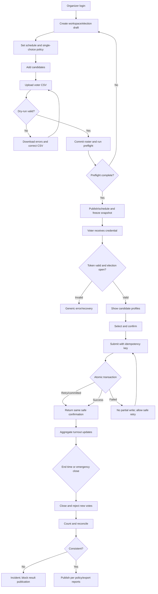

# One Voting — Product Discovery

**Versi:** 1.0  
**Tanggal:** 28 Juli 2026  
**Status:** Desk research dan hipotesis produk; belum menggantikan wawancara/pilot  
**Cakupan:** voting internal skala kecil–menengah, bukan pemilu pemerintahan

> Label: **[FAKTA]** bukti eksternal; **[INSIGHT]** interpretasi; **[ASUMSI]** belum tervalidasi; **[REKOMENDASI]** keputusan sementara; **[PERLU VALIDASI]** perlu riset primer.

---

## 1. Executive Summary

[INSIGHT] One Voting paling tepat dimulai sebagai layanan election internal berbahasa Indonesia untuk organisasi mahasiswa. Masalah utamanya bukan “belum ada aplikasi voting”, melainkan panitia sulit membuktikan empat hal secara bersamaan: pemilih memang berhak, hak pilih hanya digunakan sekali, pilihan tetap rahasia, dan hasil dapat ditelusuri tanpa membuka hubungan identitas–pilihan.

Google Forms menurunkan biaya setup, tetapi merupakan alat formulir umum. [FAKTA] Google menyediakan pembatasan satu respons, kontrol akses, pengumpulan alamat email, publikasi, dan pembagian melalui tautan/email. Fitur itu berguna, tetapi dokumentasi resminya tidak menjadikannya sistem election dengan pemisahan identitas–suara, lifecycle election, audit event, atau aturan perubahan kandidat. Voting kertas memberi observabilitas fisik, tetapi membutuhkan lokasi, petugas, logistik, dan penghitungan manual.

Direct competitors membuktikan kategori produk ini matang. [FAKTA] ElectionBuddy, OpaVote, Election Runner, dan Simply Voting menawarkan kombinasi ballot online, voter management, notifikasi, metode penghitungan, dan model harga per-election atau berdasarkan jumlah pemilih. Gap yang masuk akal bukan “fitur paling lengkap”, tetapi workflow lokal yang sederhana, mobile-first, harga sesuai organisasi kecil Indonesia, impor roster yang mudah, bahasa Indonesia, dan bukti operasional yang dapat dipahami panitia/pengawas.

[REKOMENDASI] MVP menjalankan satu election single-choice dari draft sampai laporan: organisasi/workspace sederhana; kandidat; jadwal; CSV voter; token sekali pakai; halaman kandidat; konfirmasi final; transaksi vote idempotent; pemisahan voter eligibility dari anonymous ballot; turnout agregat; auto/manual emergency close; hasil setelah tutup; export CSV; append-only audit event; RBAC. Email otomatis, OTP, PDF, branding, banyak metode ballot, billing, dan real-time public results ditunda.

[ASUMSI] Skor pain point dalam dokumen ini adalah prioritisasi analitis, bukan statistik populasi. Lima prioritas awal: (1) eligibility dan duplicate voting, (2) integritas hasil, (3) kerahasiaan terhadap insider, (4) auditability/kepercayaan, dan (5) setup serta akses mobile yang praktis. Sebelum development penuh, lakukan 8–12 wawancara organizer, 12–20 voter, 4–6 pengurus/pengawas, usability test dengan 5–8 peserta per iterasi, lalu pilot 50–200 pemilih.

**Keputusan ringkas**

| Elemen | Keputusan sementara |
|---|---|
| Beachhead | Himpunan/BEM/UKM kampus Indonesia, election 50–1.000 pemilih |
| Primary user | Election Organizer; Voter sebagai end user berisiko churn/non-partisipasi |
| Buyer awal | Organisasi/panitia; kampus menjadi buyer berikutnya |
| North Star | Completed Trusted Elections: election selesai tanpa insiden kritis dan laporan diterima organizer/pengawas |
| Lima MVP terpenting | roster+token; one-person-one-vote transaksional; secret ballot separation; lifecycle+lock; hasil+audit export |
| Bukan MVP | blockchain, biometrik, SSO kampus, native app, advanced fraud AI, white-label |

---

## 2. Research Methodology

Research plan lengkap: [`one-voting-research-plan.md`](./one-voting-research-plan.md).

Metode: desk research sumber primer; benchmark fitur/harga; threat modeling; stakeholder/job mapping; pain scoring `frekuensi × keparahan`; MoSCoW dan RICE relatif; assumption mapping. Tanggal akses semua sumber: **28 Juli 2026**.

Keterbatasan:

1. Belum ada wawancara atau data analytics One Voting.
2. Situs kompetitor mendeskripsikan klaim vendor; audit independen tidak selalu tersedia.
3. Harga dan fitur dapat berubah; cek ulang sebelum keputusan komersial.
4. Studi pemilihan kampus tidak boleh digeneralisasi ke seluruh Indonesia.
5. “Tidak ditemukan bukti” berarti riset ini belum menemukan bukti resmi, bukan bukti fitur tidak ada.

---

## 3. Background Project

Pemilihan internal menentukan legitimasi pengurus dan keputusan organisasi. Di kampus, panitia biasanya bekerja dengan masa jabatan singkat, anggaran terbatas, perangkat pribadi, dan waktu persiapan yang pendek. Mereka perlu membuat daftar pemilih, mengumumkan kandidat, membuka pemungutan suara, memantau partisipasi, menghitung hasil, serta menjawab keberatan. Setiap tahap menghasilkan risiko yang berbeda.

Voting kertas memberi pengalaman yang mudah dipahami: pemilih datang, identitas diperiksa, surat suara diberikan, pilihan dimasukkan ke kotak, lalu petugas menghitung. Namun, model ini mengikat pemilih pada lokasi dan jam tertentu. Panitia harus menyiapkan surat suara, bilik, kotak, daftar hadir, petugas, ruang, dan prosedur penghitungan. Kesalahan penandaan, surat rusak, kesalahan rekap, dan perselisihan saat hitung menambah pekerjaan. Kehadiran fisik juga dapat menurunkan partisipasi mahasiswa yang sedang praktik, bekerja, sakit, atau berada di luar kampus. [PERLU VALIDASI] Besarnya masalah dan biaya aktual harus diukur dari election terakhir di target kampus.

Form online menghapus sebagian logistik. [FAKTA] Google Forms dapat dipublikasikan, dibagikan lewat email/tautan, dibatasi kepada audiens tertentu, dibatasi satu respons, dan mengumpulkan email. Kemudahan ini menjelaskan mengapa form umum sering menjadi alternatif pertama. Namun, “satu respons per akun” tidak sama dengan “satu anggota yang berhak satu suara” ketika organisasi memakai akun pribadi, akun dipinjam, daftar anggota tidak sinkron, atau link memiliki akses umum. Jika identitas dan jawaban tersimpan dalam satu dataset yang bisa dibuka editor, panitia berpotensi melihat hubungan pemilih dengan pilihan. Form juga tidak menetapkan lifecycle election yang mencegah kandidat/aturan berubah setelah voting dimulai, tidak menyediakan audit event election khusus, dan tidak memisahkan turnout dari ballot secara konseptual. Ini bukan kelemahan Google Forms sebagai form builder; ini ketidakcocokan domain.

Platform election khusus telah mengatasi banyak masalah tersebut. [FAKTA] ElectionBuddy mendokumentasikan personal voting keys sekali pakai, anonymous voting, candidate profiles, reminders, voter-list management, beberapa metode ballot, dan hasil yang dapat disembunyikan sampai election berakhir. OpaVote mendokumentasikan voter notifications/reminders dan beragam counting method. Election Runner memasarkan election berbasis cloud yang dapat diakses dari berbagai perangkat dan harga per-election berdasarkan jumlah pemilih. Simply Voting menyediakan skema harga berdasarkan jumlah eligible voters. Produk ini menunjukkan standard category: voter eligibility, ballot configuration, lifecycle, counting, dan komunikasi.

Hambatan untuk organisasi mahasiswa Indonesia tetap ada. Harga mata uang asing, antarmuka serta dukungan nonlokal, dan kelengkapan fitur yang tinggi dapat membuat setup terasa tidak proporsional bagi election sederhana. Sebaliknya, solusi buatan panitia sering dibangun ulang setiap periode. Pergantian kepengurusan membuat pengetahuan keamanan, konfigurasi, dan incident response tidak konsisten.

Digitalisasi dibutuhkan bukan semata untuk membuat pemungutan suara “online”. Nilainya muncul jika sistem mengurangi kerja panitia sambil meningkatkan kualitas bukti: siapa yang berhak sudah ditentukan sebelum mulai; perubahan aturan berhenti setelah publish/start; satu credential hanya menandai entitlement terpakai; ballot tidak menyimpan identitas langsung; submit dilakukan dalam transaksi yang tahan retry; hasil dihitung deterministik; dan audit event mencatat tindakan administratif tanpa merekam pilihan.

Peluang awal paling jelas terdapat di himpunan, BEM, UKM, organisasi fakultas, dan pemilihan kelas. Mereka memiliki election berulang, populasi terdefinisi, akses smartphone tinggi, dan decision maker yang relatif dekat dengan pengguna. Segmen ini juga menyediakan siklus pilot yang lebih cepat daripada procurement institusional. Setelah workflow terbukti, fondasi yang sama dapat melayani sekolah, komunitas, asosiasi, perusahaan, organisasi non-profit, dan lingkungan warga. Ekspansi tidak boleh diasumsikan tanpa validasi karena aturan eligibility, kerahasiaan, quorum, proxy, weighted vote, retention, dan procurement berbeda.

[FAKTA] UU No. 27 Tahun 2022 mengatur jenis data pribadi, hak subjek data, pemrosesan, serta kewajiban pengendali dan prosesor. Karena roster dapat memuat nama, email, nomor anggota, dan status keikutsertaan, One Voting perlu menerapkan minimisasi data, tujuan pemrosesan, kontrol akses, retention, dan pemberitahuan privasi sejak MVP. [FAKTA] WCAG 2.2 memberikan success criteria yang dapat diuji dan berlaku pada perangkat mobile maupun desktop. Accessibility relevan karena kegagalan interaksi dapat menghilangkan hak suara secara praktis.

One Voting perlu dikembangkan bila riset primer membuktikan bahwa panitia bersedia berpindah dari form/kertas demi kombinasi setup sederhana, eligibility yang jelas, secret ballot, dan laporan yang dapat dipertanggungjawabkan. Produk tidak layak dibangun penuh hanya karena kategori e-voting tumbuh atau kompetitor memiliki banyak fitur. Pilot harus menunjukkan organizer dapat meluncurkan election tanpa bantuan intensif, voter dapat menyelesaikan vote, dan pengawas menerima bukti proses tanpa meminta hubungan identitas–pilihan.

---

## 4. Current Voting Process

| Tahap | Kertas | Form umum | Platform election khusus | Risiko utama |
|---|---|---|---|---|
| Tetapkan aturan | Dokumen/rapat | Dokumen terpisah | Konfigurasi election | aturan tidak konsisten |
| Roster | daftar hadir | spreadsheet/account restriction | voter list | pihak tak berhak/duplikasi |
| Kandidat | poster/surat suara | pertanyaan + gambar | candidate profile | informasi tidak setara |
| Distribusi | hadir fisik | link | personalized invite/token | link/token dibagikan |
| Verifikasi | kartu/daftar | akun/email | credential/SSO/token | false accept/reject |
| Vote | tanda pada kertas | submit form | ballot transaction | retry/duplicate/interruption |
| Turnout | hitung daftar hadir | respons masuk | aggregate tracker | privasi status |
| Count | manual | spreadsheet/chart | deterministic count | salah rumus/manipulasi |
| Audit | saksi/berita acara | version/activity terbatas | event/report | bukti tidak cukup |

[INSIGHT] Journey kritis ialah roster → authentication → consume entitlement → anonymous ballot. Jika empat langkah ini tidak dirancang sebagai satu boundary transaksional, duplicate vote dan inkonsistensi mudah terjadi.

---

## 5. Problem Statement

### Primary

**Panitia pemilihan organisasi mahasiswa mengalami kesulitan menyelenggarakan election jarak jauh yang dapat dipercaya ketika anggota memilih dari perangkat pribadi, karena eligibility, pemakaian hak pilih, kerahasiaan ballot, lifecycle, dan bukti audit dikelola dengan alat/prosedur terpisah, sehingga kerja operasional meningkat dan hasil mudah diperselisihkan.**

### Secondary dan perspektif

| Perspektif | Problem statement | Akar | Dampak |
|---|---|---|---|
| Organizer | Panitia kesulitan menyiapkan serta memonitor election ketika roster, undangan, status, dan hasil tersebar, karena alat umum tidak memodelkan lifecycle election | proses manual, pergantian panitia | setup lambat, salah konfigurasi |
| Voter | Pemilih kesulitan menggunakan hak pilih dengan yakin ketika akses atau submit gagal, karena autentikasi tidak jelas dan tidak ada konfirmasi aman | login rumit, koneksi, feedback ambigu | abstain tidak sengaja, retry |
| Candidate | Kandidat kesulitan mempercayai perlakuan setara ketika profil, jadwal, atau ballot bisa berubah tanpa jejak | aturan perubahan lemah | keberatan, delegitimasi |
| Supervisor | Pengawas kesulitan menilai integritas election ketika tindakan admin dan rekonsiliasi tidak dapat ditelusuri | audit log tidak khusus/alterable | sengketa sulit diselesaikan |
| Organization admin | Pengurus kesulitan mempertanggungjawabkan data dan hasil ketika akses panitia terlalu luas | least privilege/retention tidak jelas | leakage, reputasi, risiko hukum |

**Akar masalah:** roster tidak terstandardisasi; identity proofing lemah; credential dapat dibagikan; state machine tidak eksplisit; identity dan ballot bercampur; operasi submit tidak idempotent; admin terlalu berkuasa; audit event tidak lengkap; akses mobile/koneksi lemah tidak diuji; SOP sengketa dan emergency close tidak ada.

**Di luar MVP:** membuktikan identitas sipil; mencegah coercion/account sharing sepenuhnya; pemilu publik; universal verifiability kriptografis; biometrik; weighted/proxy/ranked choice; integrasi pemerintah; offline voting penuh.

---

## 6. How Might We Questions

1. Bagaimana memastikan hanya anggota eligible yang dapat memakai tepat satu entitlement?
2. Bagaimana memisahkan status “sudah memilih” dari isi pilihan?
3. Bagaimana memberi konfirmasi tercatat tanpa membuat receipt yang membuktikan kandidat pilihan?
4. Bagaimana membantu panitia nonteknis meluncurkan election dengan konfigurasi aman?
5. Bagaimana membuat tindakan admin dapat diaudit tanpa mencatat pilihan voter?
6. Bagaimana menangani retry dan koneksi putus tanpa duplicate ballot?
7. Bagaimana mengunci aturan/kandidat ketika election sudah berjalan?
8. Bagaimana membantu pengawas merekonsiliasi eligible, used entitlement, dan ballot count?

---

## 7. Target User

| User | Klasifikasi | Tujuan/aktivitas | Digital/perangkat/kondisi | Boleh akses | Tidak boleh akses | Dorongan / penolakan |
|---|---|---|---|---|---|---|
| Super Admin | supporting/operator | tenant support, abuse/security | tinggi; desktop | metadata operasional terbatas | isi ballot, password/token plaintext | stabilitas / liability tinggi |
| Election Organizer | **primary** | setup, roster, publish, monitor, close | sedang; laptop+HP; deadline | konfigurasi, roster sesuai peran, turnout | hubungan voter–choice | hemat kerja / takut salah setup |
| Organization Admin | decision maker/buyer | menunjuk panitia, governance | sedang; laptop | anggota, policy, laporan | secret choice | legitimasi / biaya, vendor trust |
| Voter | **end user** | verifikasi, baca kandidat, vote | bervariasi; dominan HP; koneksi berubah | ballot, status sendiri, hasil sesuai policy | roster/status orang lain | praktis / privasi, login rumit |
| Candidate | secondary | profil, memahami aturan/hasil | sedang; HP | profil publik, hasil | roster sensitif, pilihan voter | perlakuan setara / curiga admin |
| Supervisor | supporting | review setup, event, hasil | sedang–tinggi; laptop | read-only config, aggregate, audit | choice per identity | bukti / audit tidak independen |
| Public Viewer | optional | melihat hasil publik | bervariasi | hasil yang dipublish | roster, audit internal | transparansi / salah tafsir |

### Market segmentation

| Segmen | Need fit | Sales friction | Variasi aturan | Prioritas |
|---|---:|---:|---:|---|
| Kampus/ormawa | tinggi | rendah–sedang | sedang | **Beachhead** |
| Sekolah | tinggi | sedang | sedang; guardian/minor privacy | kedua |
| Komunitas | sedang–tinggi | rendah | tinggi | pilot oportunistik |
| Perusahaan | sedang | tinggi | tinggi, compliance/SSO | kemudian |
| Non-profit/asosiasi | tinggi | sedang | weighted/proxy mungkin | setelah MVP |
| Lingkungan warga | sedang | rendah–sedang | identity/offline kompleks | kemudian |

[REKOMENDASI] Fokus awal: ormawa dengan 50–1.000 eligible voters dan single-choice election. Populasi jelas, siklus berulang, decision maker mudah dijangkau, dan fitur kompleks belum wajib. [PERLU VALIDASI] willingness-to-pay dan kebijakan kampus.

---

## 8. Stakeholder Analysis

| Stakeholder | Pengaruh | Kepentingan | Strategi |
|---|---:|---:|---|
| Organization Admin | tinggi | tinggi | libatkan pada policy dan acceptance pilot |
| Organizer | tinggi | tinggi | co-design workflow dan usability |
| Voter | sedang | tinggi | test mobile, trust, accessibility |
| Supervisor | tinggi | tinggi | definisikan evidence/report |
| Candidate | sedang | tinggi | uji fairness perception |
| IT kampus | tinggi | sedang | konsultasi domain/email/retention |
| Legal/DPO | tinggi | sedang | review privacy basis dan kontrak |
| Super Admin | tinggi | sedang | runbook dan break-glass control |

---

## 9. User Persona

### Nabila, 20 — Ketua Panitia Pemira Himpunan
- Latar: mahasiswa semester 5, panitia 12 orang; digital sedang; laptop Windows dan Android.
- Tujuan: election selesai tepat waktu tanpa spreadsheet kacau.
- Motivasi: hasil diterima semua kandidat. Frustrasi: CSV kotor, reminder manual, takut salah publish.
- Perilaku: meniru SOP tahun lalu, bekerja malam hari.
- Skenario: impor 620 NIM/email, cek error, publish, pantau turnout.
- Kutipan: “Saya perlu tahu prosesnya benar tanpa bisa melihat siapa memilih siapa.”
- JTBD: **When I menyiapkan election dengan waktu terbatas, I want to memvalidasi roster dan konfigurasi sebelum publish, so I can menghindari kesalahan yang tidak bisa diperbaiki saat voting berjalan.**

### Rizky, 19 — Mahasiswa Pemilih
- Latar: tinggal di kos, digital tinggi, Android murah; koneksi seluler tidak stabil.
- Tujuan: vote kurang dari dua menit dan yakin tercatat.
- Motivasi: ikut menentukan pengurus. Frustrasi: login berulang dan submit menggantung.
- Perilaku: membuka link dari grup chat, membaca kandidat sesaat sebelum vote.
- Skenario: token dibuka di HP; jaringan putus setelah submit.
- Kutipan: “Kalau saya tekan lagi, jangan sampai suara masuk dua kali.”
- JTBD: **When I memilih lewat HP dengan koneksi tidak stabil, I want to mendapat status submit yang tegas, so I can yakin hak pilih saya tercatat tanpa mengulang suara.**

### Dimas, 23 — Ketua Organisasi
- Latar: pengurus akhir masa jabatan; digital sedang; MacBook dan iPhone.
- Tujuan: election sah dan arsip dapat diserahkan.
- Motivasi: transisi kepengurusan. Frustrasi: vendor mahal, kepemilikan data kabur.
- Perilaku: meminta laporan dan berita acara sebelum menyetujui.
- Skenario: menetapkan panitia, menyetujui policy hasil, menerima laporan.
- Kutipan: “Saya butuh bukti yang dapat dijelaskan saat ada keberatan.”
- JTBD: **When I mempertanggungjawabkan election kepada anggota, I want to menerima laporan proses dan hasil yang konsisten, so I can mendukung legitimasi pengurus terpilih.**

### Sari, 22 — Pengawas Election
- Latar: dewan pengawas mahasiswa; digital sedang–tinggi; laptop Linux dan Android.
- Tujuan: menguji kepatuhan tanpa mengoperasikan election.
- Motivasi: fairness. Frustrasi: log dapat diedit dan akses read-only tidak ada.
- Perilaku: mencatat timestamp, membandingkan roster dan hasil.
- Skenario: review preflight, mengamati status, export audit.
- Kutipan: “Saya tidak perlu melihat pilihan; saya perlu melihat apakah aturan dipatuhi.”
- JTBD: **When I mengawasi election, I want to melihat konfigurasi terkunci dan event administratif read-only, so I can menilai proses tanpa memperoleh akses berlebihan.**

---

## 10. Jobs to Be Done

| Role | Functional job | Emotional/social job |
|---|---|---|
| Organizer | meluncurkan dan mengoperasikan election | tidak menjadi sumber kesalahan |
| Voter | memakai hak pilih sekali | merasa pilihan rahasia dan berarti |
| Admin | menetapkan governance | menjaga legitimasi organisasi |
| Candidate | menerima perlakuan setara | percaya kekalahan bukan manipulasi |
| Supervisor | merekonsiliasi proses | dapat menjelaskan temuan secara netral |

---

## 11. Pain Points

> [ASUMSI] F dan S adalah skor desk-research yang harus dikalibrasi melalui wawancara dan incident history.

| # | Kategori; pain point | Pengguna/situasi | Akar → dampak | F | S | Skor | Workaround; kelemahan | Peluang |
|---:|---|---|---|---:|---:|---:|---|---|
| 1 | Security: voter tidak terverifikasi/link bocor | organizer; remote vote | link umum → pihak tak berhak | 4 | 5 | 20 | domain/account; tidak selalu cocok roster | roster-bound credential |
| 2 | Security: duplicate vote | semua; submit/login | identifier/account lemah → hasil invalid | 4 | 5 | 20 | dedupe sheet; terlambat/merusak rahasia | unique entitlement+constraint |
| 3 | Trust: hasil diragukan/manipulasi | kandidat/pengawas | admin access, bukti minim → sengketa | 4 | 5 | 20 | saksi/screenshot; tidak lengkap | lock+audit+reconciliation |
| 4 | Privacy: admin melihat identity–choice | voter | data bercampur → chilling effect/leak | 3 | 5 | 15 | janji panitia; bukan kontrol teknis | data separation |
| 5 | Reporting: audit trail tidak ada | pengawas | alat umum → investigasi lemah | 3 | 5 | 15 | chat/log manual; alterable | append-only event export |
| 6 | Operational: hitung lambat/salah | panitia; kertas/sheet | manual → delay/recount | 4 | 4 | 16 | formula/dua petugas; human error | deterministic count |
| 7 | UX: mobile tidak nyaman | voter | desktop form/large media → abandon | 4 | 4 | 16 | zoom/ganti device | mobile-first budget |
| 8 | Technical: koneksi putus saat submit | voter | status ambigu/retry → duplicate/anxiety | 3 | 5 | 15 | chat panitia; membuka privasi/status | idempotency+status safe |
| 9 | Administrative: roster/CSV kotor | organizer | format beragam → salah eligibility | 4 | 4 | 16 | cleanup sheet; error tersembunyi | dry-run validation |
| 10 | Monitoring: turnout sulit dipantau | organizer | respons dan eligible terpisah → reminder salah | 4 | 3 | 12 | VLOOKUP; privacy risk | aggregate+not-voted list scoped |
| 11 | Administrative: tidak bisa emergency close | organizer | form/state sederhana → insiden meluas | 2 | 5 | 10 | unpublish; bukti tidak jelas | emergency close+reason |
| 12 | UX: login rumit | voter | banyak langkah/account mismatch → abstain | 4 | 3 | 12 | link publik; menurunkan keamanan | token flow sederhana |
| 13 | Communication: lupa jadwal | voter | announcement tenggelam → turnout turun | 4 | 3 | 12 | grup chat; manual/spam | reminder post-MVP |
| 14 | Candidate: profil tidak memadai | kandidat/voter | media tersebar → pilihan kurang informasi | 3 | 3 | 9 | PDF/social media; context switching | profile ringkas |
| 15 | Privacy: data voter terekspos | voter/admin | export/access luas → liability | 2 | 5 | 10 | private sheet; sharing error | RBAC+minimization+retention |
| 16 | Results: pengumuman lambat | semua | count/approval manual → rumor | 3 | 3 | 9 | posting manual | policy-driven publish |
| 17 | Accessibility: hambatan visual/motor | voter | UI tidak diuji → disenfranchisement | 2 | 5 | 10 | bantuan orang lain; merusak rahasia | WCAG-focused design |
| 18 | Financial: platform mahal/rumit | buyer | USD/feature overload → kembali ke form | 3 | 3 | 9 | DIY; security debt | local simple tier |

---

## 12. Pain Point Prioritization

Lima prioritas MVP:

1. **Eligibility + duplicate prevention (20):** outcome election invalid jika gagal.
2. **Integritas hasil dan lifecycle (20):** kandidat/aturan/hasil harus terlindungi.
3. **Secret ballot terhadap insider (15, severity 5):** trust dan privasi inti.
4. **Audit/reconciliation (15):** pengawas perlu bukti, bukan akses pilihan.
5. **Roster/mobile/retry reliability (15–16):** election gagal secara praktis bila setup atau submit tidak andal.

[INSIGHT] Reminder dan branding dapat meningkatkan adopsi, tetapi tidak boleh menggeser kontrol integritas. Real-time public result berpotensi memengaruhi voter dan tidak masuk default MVP.

---

## 13. Existing Solutions

- **Kertas:** mudah dipahami, observasi fisik; mahal secara waktu/logistik dan tidak remote.
- **Google Forms:** cepat, familiar, murah; domain form umum, bukan election lifecycle/audit.
- **Microsoft Forms:** cocok ekosistem Microsoft; pembuktian fitur election khusus tidak ditemukan dalam riset ini.
- **WhatsApp/Telegram poll:** komunikasi cepat; eligibility, secret ballot governance, export audit tidak memadai untuk election formal.
- **Form + spreadsheet buatan panitia:** fleksibel; knowledge/security debt berulang tiap periode.
- **Platform election khusus:** kontrol domain lebih lengkap; harga, kompleksitas, lokalisasi, dan procurement dapat menjadi hambatan.

---

## 14. Competitor Analysis

| Produk | Asal | Target/value | Bukti fitur resmi | Auth/distribusi/duplicate | Privacy/audit/results | Harga* | Kekuatan | Gap untuk One Voting |
|---|---|---|---|---|---|---|---|---|
| ElectionBuddy | Kanada [PERLU VALIDASI legal entity] | berbagai organisasi; DIY–managed | banyak voting systems, candidate profiles, voter list, reminders, subgroup, mobile devices | personalized notice; personal voting key sekali pakai; opsi second password/phone | anonymous choices; hide results; independent verification/recount disebut | tiered; cek halaman pricing | feature breadth | workflow lokal sederhana dan harga IDR |
| Simply Voting | Kanada | organisasi/institusi; self-administered atau managed election | setup waktu/pertanyaan, branded site, online/telephone/paper/nominations | organizer memilih metode autentikasi dan mengunggah eligible voter; login hanya membuka ballot bila belum memilih | vendor menyebut ballot tamper-proof, vote terenkripsi, receipt, dan hasil dapat diverifikasi; ini klaim vendor, bukan sertifikasi independen | gratis ≤10; selebihnya berdasar eligible voters melalui kalkulator/quote | layanan formal dan managed option | harga final, format audit export, dan accessibility conformance perlu diminta |
| OpaVote | AS [PERLU VALIDASI entity] | online election + ranked counting | reminders, checkbox, ranked-choice, STV, Condorcet, Borda, multi-bahasa, API | daftar email atau kode unik membatasi voter tertentu dan satu vote | mode anonymous; monitoring email/ballot/submission dan downloadable result merupakan audit operasional, bukan E2E verification | gratis ≤25 voter/10 kandidat; USD10 per 125 voter atau 20 kandidat saat akses | transparan, ekonomis, metode hitung kaya | feature breadth tidak diperlukan untuk MVP single-choice |
| Election Runner | AS [PERLU VALIDASI entity] | sekolah/organisasi | cloud election, CSV/Excel, schedule, candidate bio/photo, branding, result | Voter ID + Voter Key unik; satu kali vote | HTTPS 256-bit dan hasil otomatis diklaim; unlinkability, exportable audit log, recount, atau independent verification tidak ditemukan pada sumber yang diperiksa | $0 ≤20; $19 ≤100; $36 ≤300; $49 ≤500; $75 ≤750; $90 ≤1.000 saat akses | pay-per-election, mobile/app, harga jelas | bahasa/pembayaran lokal dan evidence audit; vendor menyatakan app menargetkan WCAG 2.0 AA/Section 508, bukan sertifikasi |

\* Harga ialah snapshot 28 Juli 2026; jangan dipakai sebagai quotation.

**Review/keluhan:** Riset ini tidak menemukan corpus review independen yang cukup kuat untuk membuat klaim keluhan terukur. Testimonial vendor tidak diperlakukan sebagai bukti netral. [REKOMENDASI] lakukan 5–8 teardown trial dan wawancara pengguna yang pernah memakai produk tersebut.

---

## 15. Competitor Feature Matrix

Legenda: ✓ bukti resmi ditemukan; ◐ sebagian/konfigurasi umum; ? bukti belum ditemukan; — tidak berlaku/tidak tersedia secara inheren.

| Fitur | One Voting proposed | ElectionBuddy | OpaVote | Election Runner | Google Forms | Kertas |
|---|---:|---:|---:|---:|---:|---:|
| Roster voter | ✓ | ✓ | ✓ | ✓ | ◐ | ✓ manual |
| Credential personal | ✓ | ✓ | ? | ✓ vendor claim | ◐ account | — |
| One entitlement once | ✓ | ✓ | ? | ✓ vendor claim | ◐ one response | ✓ daftar |
| Secret identity–ballot separation | ✓ | ✓ anonymous claim | ? | ? | ?/tidak khusus | ✓ bila prosedur benar |
| Candidate profile | ✓ ringkas | ✓ | ◐ ballot | ✓ | ◐ | ◐ poster |
| Schedule/lifecycle | ✓ | ✓ | ✓ | ✓ | ◐ publish/access | manual |
| Lock after start | ✓ | ? | ? | ? | ? | prosedural |
| Turnout | ✓ agregat | ✓ | ? | ✓ | ◐ response count | manual |
| Auto count | ✓ | ✓ | ✓ | ✓ | ✓ summary/sheet | — |
| Hide until end | ✓ default | ✓ | ? | ? | ◐ jangan share summary | prosedural |
| Audit event export | ✓ | ◐ independent review claim | ? | ? | ? | berita acara |
| Reminder | v1.1 | ✓ | ✓ | ✓ | manual | manual |
| Mobile | ✓ | ✓ | web | ✓ | ✓ | — |
| Bahasa Indonesia | ✓ | customizable language | ? | ? | ✓ UI/content | ✓ |
| Advanced voting methods | future | ✓ | ✓ | ✓ | manual config | manual |

---

## 16. Market Gap

**Position maps (ordinal, analyst estimate; perlu usability/security teardown):**

- Ease tinggi/security domain tinggi: ElectionBuddy, Election Runner.
- Ease tinggi/security domain rendah–sedang: Google Forms.
- Ease sedang/feature-counting tinggi: OpaVote.
- Kertas: ease remote rendah; audit fisik bergantung SOP.
- Target One Voting: ease sangat tinggi untuk election sederhana; security domain tinggi tanpa feature overload.

Harga vs kelengkapan: Google Forms murah/umum; OpaVote relatif efisien dengan counting kaya; ElectionBuddy kaya; Election Runner pay-per-election; One Voting menargetkan tier lokal sederhana.

**Diferensiasi yang layak diuji:** bahasa dan copy lokal; wizard preflight; CSV template NIM/member ID; token mudah; mobile low-bandwidth; policy secret ballot; reconciliation report yang mudah dijelaskan; harga IDR/per-election.

**Jangan ditiru pada MVP:** banyak voting method; live public result default; proxy/weighted vote; heavy customization; white-label; fitur enterprise; receipt yang mengungkap pilihan.

**Table stakes:** eligibility, once-only entitlement, secret ballot, lifecycle/schedule, candidate ballot, deterministic count, mobile usability, confirmation, RBAC, audit event, export, privacy notice.

---

## 17. Product Positioning

1. **Recommended:** “For organisasi mahasiswa Indonesia yang perlu menjalankan pemilihan internal terpercaya tanpa tim teknis, One Voting adalah platform election web yang menyederhanakan roster, pemungutan suara rahasia, dan laporan audit. Unlike form umum, One Voting memisahkan eligibility dari ballot dan mengunci lifecycle election.”
2. “For komunitas dan organisasi kecil yang menganggap platform global terlalu kompleks, One Voting adalah layanan pay-per-election berbahasa Indonesia dengan setup mobile-first dan kontrol integritas inti.”
3. “For pengurus yang harus mempertanggungjawabkan hasil, One Voting adalah election management system yang menghasilkan rekonsiliasi dan jejak tindakan tanpa membuka pilihan individual.”

[REKOMENDASI] Uji positioning pertama terhadap organizer, ketiga terhadap decision maker. Hindari klaim “100% aman”, “anti-curang”, atau “tidak dapat dimanipulasi”.

---

## 18. Solution Hypothesis

| Hipotesis | Problem/target/solusi | Perilaku & outcome | Risiko | Validasi & metric | Accept/reject |
|---|---|---|---|---|---|
| Primary | organizer; workflow terpencar; wizard end-to-end + controls | launch mandiri, sengketa turun | panitia tetap pilih form | prototype+pilot; setup completion/time | accept ≥80% selesai tanpa fasilitator dan median ≤30 menit; reject <50% |
| Organizer | roster kotor; CSV dry-run | perbaiki sebelum publish | format kampus sangat beragam | task test; import success | accept ≥90% baris valid terimpor setelah satu koreksi |
| Voter | akses/submit ambigu; token+idempotent submit | vote cepat dan yakin | token sharing | pilot; completion/time/trust | ≥95% completion, median ≤2 menit, ≥80% yakin tercatat |
| Org admin | governance lemah; RBAC+lock | delegasi tanpa akses berlebih | peran terlalu kompleks | card sort/pilot | 90% permission tasks dipahami |
| Security/trust | identity–choice risk; separated stores+audit | pengawas menerima evidence | model belum cukup untuk threat | architecture review+tabletop | zero critical finding sebelum pilot; reconciliation exact |
| Participation | friction tinggi; mobile low-bandwidth + reminder v1.1 | lebih banyak eligible selesai | turnout dipengaruhi kandidat | A/B/past-baseline | +10 poin relatif hanya jika comparable |
| Supervisor | audit minim; read-only event/report | review tanpa data pilihan | log tidak independen | scenario review | ≥80% pengawas dapat menjawab checklist |
| Candidate | fairness; immutable ballot config after start | keberatan konfigurasi turun | kebutuhan edit darurat | tabletop | seluruh perubahan menghasilkan cancel/restart decision |

---

## 19. Assumption Mapping

| Asumsi | Kategori | Penting | Tidak pasti | Uji |
|---|---|---:|---:|---|
| organizer akan pindah dari Forms untuk trust controls | desirability | 5 | 5 | interview + fake door |
| token email/member ID cukup untuk target risiko | security | 5 | 5 | threat modeling + pilot abuse test |
| separation model dapat diaudit tanpa deanonymization | feasibility/security | 5 | 4 | architecture review |
| organisasi bersedia membayar per election IDR | viability | 4 | 5 | price interview/checkout fake door |
| dasar pemrosesan, notice, retention dapat distandardisasi | legal/privacy | 5 | 4 | counsel/DPO review |
| single-choice menutup mayoritas use case awal | desirability | 4 | 4 | historical election sample |
| email delivery cukup | feasibility | 3 | 5 | deliverability test; opsi organizer-distributed token |
| turnout naik karena akses mudah | desirability | 3 | 4 | comparable pilot |

**Tiga asumsi paling berisiko:** willingness to switch; adequacy/abuse resistance credential; trustworthiness of identity–ballot separation. Validasi sebelum full build.

---

## 20. MVP Definition

### V1

1. Organizer registration/login dan satu workspace sederhana.
2. Election draft: nama, deskripsi, timezone, start/end, single-choice, secret result-until-close.
3. Candidate: nomor, nama, foto terkompresi, visi-misi ringkas; pasangan sebagai satu candidate entry.
4. Voter: CSV/manual, normalized unique identifier, validation preview, revoke sebelum start.
5. Access: random high-entropy one-time token; organizer dapat export/distribute; email delivery opsional manual.
6. Voting: token verify, candidate view, selection, confirmation, idempotency key, atomic consume-entitlement + ballot insert.
7. Lifecycle: draft → published/scheduled → open → closed/cancelled → archived; immutable candidate/rule/roster after open; auto-close; emergency close with reason.
8. Monitoring: eligible, voted count, turnout, duration; tanpa candidate totals saat open.
9. Results: count after close, abstain jika diaktifkan, CSV report, reconciliation.
10. Security/trust: RBAC, password hash, HTTPS, secure session, rate limit, append-only audit event, backups, redacted logs.

### V1.1

Email verification/invitation/reminder/resend; PDF report; branding dasar; duplicate election; voter groups; yes/no; multiple-choice; public result page; archive/retention UI; supervisor signature/attestation.

### Future

SSO kampus, custom domain/white-label, billing/subscription, multilingual, ranked/weighted/proxy, API/integrasi SIS, cryptographic verifiability research, multi-region, native app. Biometrics/blockchain/AI fraud hanya setelah problem evidence dan review etis/legal.

---

## 21. Feature Prioritization

RICE: Reach 1–5, Impact 0.5–3, Confidence 0–1, Effort person-weeks; skor `(R×I×C)/E`, bersifat relatif.

| Feature | Problem/user story ringkas | AC tinggi | MoSCoW | Dep./risiko | RICE | Scope |
|---|---|---|---|---|---:|---|
| election lifecycle+lock | organizer perlu aturan stabil | transisi valid; edit kritis ditolak saat open | Must | state bugs | 7.5 | V1 |
| roster CSV validation | eligibility | preview error; unique normalized ID | Must | PII/import | 8.0 | V1 |
| one-time token | access | hash token; expiry/state; rate limit | Must | sharing | 6.0 | V1 |
| atomic idempotent vote | duplicate/retry | satu entitlement, satu ballot, safe retry | Must | concurrency | 6.8 | V1 |
| identity–ballot separation | privacy | no direct FK/read path for organizer | Must | reidentification | 4.5 | V1 |
| candidate profile | informed choice | required name/no; accessible image/text | Must | media abuse | 7.2 | V1 |
| turnout aggregate | monitoring | count only; no live result | Must | status privacy | 8.1 | V1 |
| result+reconciliation CSV | trust | ballot total equals used entitlements or explained | Must | formula/export | 7.0 | V1 |
| audit event | dispute | actor/action/time/reason; no choice | Must | log tamper | 4.2 | V1 |
| emergency close | incident | authorized; reason; event; no reopen | Must | misuse | 5.4 | V1 |
| email reminder | participation | only not-voted; opt policy | Should | deliverability | 4.0 | 1.1 |
| PDF | reporting | stable printable report | Should | rendering | 2.4 | 1.1 |
| branding | buyer | logo/colors constrained | Could | scope creep | 1.8 | 1.1 |
| multiple/ranked vote | broader cases | method-specific validation/count | Won’t now | correctness | 1.0 | Future |
| OTP | stronger access | expiry/retry/recovery | Won’t now | cost/delivery | 1.2 | Future |
| blockchain/biometric/native app | no proven need | n/a | Won’t | cost/privacy | <0.5 | Future only |

---

## 22. User Stories

1. As an organizer, I want to create an election so that rules are centralized.
2. As an organizer, I want to add candidates so that voters receive consistent information.
3. As an organizer, I want to import voters so that eligibility matches the approved roster.
4. As an organizer, I want to set a timezone-aware schedule so that access opens/closes predictably.
5. As an organizer, I want to publish after preflight so that incomplete configuration cannot go live.
6. As a voter, I want to authenticate with my credential so that only eligible members vote.
7. As a voter, I want to compare candidate profiles so that I can make an informed choice.
8. As a voter, I want to submit once so that retry cannot duplicate my ballot.
9. As a voter, I want a non-revealing confirmation so that I know the vote was recorded.
10. As an organizer, I want aggregate turnout so that I can monitor participation without seeing choices.
11. As an organizer, I want to emergency-close with a reason so that an incident stops safely.
12. As an organizer, I want results only after close so that live totals do not influence voters.
13. As an organizer, I want a report so that the organization can archive the election.
14. As a supervisor, I want read-only audit events so that I can review compliance.

---

## 23. Acceptance Criteria

| Story | Given | When | Then |
|---|---|---|---|
| Create | organizer authorized | saves valid draft | draft exists and audit event records creation |
| Candidate | election draft | valid candidate added | candidate appears in preview; duplicate number rejected |
| Import | CSV selected | dry-run runs | valid/error rows shown; commit requires confirmation |
| Schedule | timezone/start/end valid | save | UTC stored, local display preserved, end > start |
| Publish | all preflight checks pass | publish confirmed | state scheduled/open; immutable snapshot created |
| Authenticate | eligible, valid unused token | token submitted | limited ballot session issued; raw token not logged |
| View candidate | ballot session valid | page opens | all candidates render accessibly in fixed order |
| Vote | eligible and unused | confirmed choice submitted | transaction consumes entitlement and inserts one ballot |
| Retry | previous request committed | same idempotency key retried | same success response; no second ballot |
| Confirmation | vote committed | response shown | receipt reference/status excludes chosen candidate |
| Turnout | election active | organizer views dashboard | eligible/used/percentage only; no candidate totals |
| Close | authorized organizer | close confirms with reason | no new ballot accepted; audit event written |
| Results | election closed | result requested | deterministic totals and reconciliation displayed |
| Export | result available | CSV download | checksummed export contains aggregate, config, timestamps |
| Audit | supervisor assigned | opens log | read-only ordered events; no ballot choice or secret token |

---

## 24. User Flow

**Normal:** organizer → workspace → draft → schedule/method → candidates → roster dry-run/commit → preflight → publish → voter receives token → authenticate → read ballot → select → confirm → atomic submit → safe receipt → organizer sees turnout → auto/manual close → count/reconcile → publish/export.

**Alternative:** manual voter entry; scheduled publish; abstain enabled; organizer-distributed token; result private; emergency close.

**Error:** invalid/expired/revoked token; voter absent; already used; not-started/closed election; network interruption; invalid CSV; no candidate; forbidden edit; count mismatch. Errors must reveal minimum information and give a recovery path. Count mismatch blocks publication and raises incident state.

---

## 25. Role and Permission Matrix

`A` allow, `R` read-only, `S` self-only, `–` deny. Least privilege default.

| Permission | Super Admin | Org Admin | Organizer | Supervisor | Candidate | Voter | Public |
|---|---:|---:|---:|---:|---:|---:|---:|
| Create election | – | A | A | – | – | – | – |
| Edit draft | – | A | A | R | profile request | – | – |
| Publish/start | – | A | A | R | – | – | – |
| Close/cancel | break-glass only | A | A | R | – | – | – |
| Candidate CRUD before start | – | A | A | R | S proposal | – | – |
| Import/remove voter before start | – | A | A | R aggregate | – | – | – |
| View voter identity | support metadata only | A scoped | A scoped | R if policy | – | S | – |
| View voting status | aggregate | aggregate | aggregate + not-voted if policy | aggregate | – | S | – |
| View selected candidate | **–** | **–** | **–** | **–** | **–** | after submit: – | – |
| View result | support metadata | A | A | R | per policy | per policy | published only |
| Publish result | – | A | A | R | – | – | – |
| Export report | – | A | A | R | – | – | – |
| View audit log | security subset | A | A | R | – | self event | – |
| Manage org member | – | A | – | – | – | – | – |
| Billing | – | A | – | – | – | – | – |

Break-glass wajib beralasan, time-bound, dan diaudit; tidak memberikan akses ballot plaintext.

---

## 26. Security and Privacy Analysis

Skala likelihood/impact: L/M/H; risk mengikuti kombinasi kualitatif.

| Threat | Impact | Likelihood | Risk | Mitigasi | MVP |
|---|---:|---:|---:|---|---:|
| duplicate voting/retry | H | H | Critical | unique DB constraint, transaction, idempotency | wajib |
| account/token sharing | H | M | High | token personal, expiry, optional secondary attribute, anomaly log; akui coercion limit | wajib dasar |
| brute force/enumeration | H | M | High | high entropy token, rate limit, generic errors, monitoring | wajib |
| credential stuffing organizer | H | M | High | strong hash, breached-password check, rate limit, MFA post-MVP | wajib dasar |
| unauthorized admin | H | M | High | RBAC, session timeout, re-auth sensitive action, audit | wajib |
| SQL injection | H | M | High | parameterized ORM/query, validation, tests | wajib |
| XSS | H | M | High | output encoding, sanitization, CSP, upload controls | wajib |
| CSRF | H | M | High | SameSite, CSRF token/origin check | wajib |
| result manipulation | H | M | Critical | immutable snapshot, deterministic count, signed/checksummed export, separation | wajib |
| candidate changed while open | H | M | High | state guard + DB authorization | wajib |
| ballot deletion/insider | H | L–M | High | append-only policy, restricted DB role, backup, reconciliation | wajib |
| data leakage | H | M | High | minimization, encryption at rest/provider, access log, export control | wajib |
| DDoS | H | M | High | CDN/WAF, rate limit, capacity test, incident close/extension SOP | wajib dasar |
| lost email access | M | M | Medium | supervised credential reissue before use with revocation event | wajib SOP |
| submit interruption | H | H | Critical | atomic transaction + idempotent retry/status | wajib |
| audit log modification | H | L–M | High | append-only table/DB role, hash chaining future, offsite export | wajib dasar |

### Architecture principles

- **Identity/entitlement store:** voter ID/contact, token hash, eligibility, used timestamp. No candidate choice.
- **Ballot store:** random ballot ID, election snapshot ID, selection, timestamp bucket as needed; no voter ID/token/IP.
- Setelah eligibility diperiksa, sistem menerbitkan token cast acak, berentropi tinggi, sekali pakai, dan berumur pendek. Ballot box memvalidasi token tanpa menerima identitas langsung.
- Endpoint cast menerima `Idempotency-Key`. Satu transaksi atomik memeriksa lifecycle, mengonsumsi token, memasukkan ballot, dan mencatat event. Retry dengan key serta payload yang sama mengembalikan hasil yang sama; key sama dengan payload berbeda ditolak.
- Unique constraint dan locking/serializable semantics ditegakkan di database; tombol disabled atau pemeriksaan application-layer saja tidak cukup.
- Application mengembalikan random non-choice receipt reference. Receipt tidak boleh membuktikan pilihan kepada pihak ketiga karena dapat memfasilitasi coercion atau jual-beli suara.
- Avoid precise metadata combinations that reidentify voters, especially low-turnout groups.
- Logs exclude token, candidate choice, form body, and unnecessary IP; security IP retention pendek dan purpose-bound.
- Election snapshot locks candidates, method, and policy at start.
- Reconciliation: `used_entitlements = accepted_ballots`; mismatch blocks publish.
- Audit event minimal memuat UTC, actor, action, object, outcome, correlation ID, dan configuration hash. Gunakan append-only storage; hash chaining/HMAC dan penyimpanan terpisah/WORM masuk P1. Verifikasi integritas log harus otomatis.
- Threat model residual wajib menyebut malware pada perangkat voter, coercion di luar sistem, token sharing, dan kolusi admin. One Voting tidak boleh mengklaim telah menghilangkan risiko tersebut.

### Privacy

[FAKTA] UU PDP mencakup hak subjek, pemrosesan, serta kewajiban pengendali/prosesor. [REKOMENDASI] tentukan peran kontraktual: organisasi sebagai pengendali dan One Voting sebagai prosesor untuk roster/election, dengan pengecualian data akun/service security yang perlu dianalisis. Tampilkan privacy notice, purpose, retention, contact, dan mekanisme hak subjek. Jangan meminta NIK jika member ID/email cukup. Tetapkan retention configurable; proposal awal: raw contact/token data dihapus 30–90 hari setelah finalisasi, aggregate/report sesuai policy organisasi. [PERLU VALIDASI legal] dasar pemrosesan, retention, DPA, lokasi data, breach response.

[FAKTA] UU PDP menetapkan kewajiban pemberitahuan tertulis atas kegagalan pelindungan data pribadi paling lambat 3 × 24 jam sesuai ketentuan UU. MVP memerlukan processing register, breach runbook, serta jalur eskalasi kepada organisasi sebagai pengendali. Penerapan konkret harus ditinjau penasihat hukum Indonesia.

### Security dan accessibility release gates

1. Target baseline **OWASP ASVS Level 2** untuk aplikasi internet-facing; setiap requirement terkait memiliki test/evidence.
2. MFA wajib untuk Organization Admin, Election Organizer, Supervisor berprivilege, dan Super Admin; voter tidak dipaksa membuat password baru jika credential roster atau SSO yang sesuai tersedia.
3. Uji 100+ concurrent retries untuk cast yang sama harus menghasilkan tepat satu ballot dan respons idempoten.
4. Restore backup, audit-log tamper detection, object-level authorization, rate-limit abuse, dependency scan, dan reconciliation test harus lulus.
5. Critical voting journey ditargetkan **WCAG 2.2 AA** dan diuji dengan keyboard-only, screen reader, zoom/reflow, mobile, serta koneksi lambat; tidak boleh ada blocker A/AA.
6. Semua temuan high/critical ditutup sebelum pilot berdampak nyata. Untuk election berisiko tinggi, perlukan pentest independen.

### Trade-off

- Akses token sederhana meningkatkan completion tetapi lebih rentan forwarding.
- OTP menambah assurance sekaligus biaya, failure rate, dan dependency.
- Full anonymity mengurangi investigasi individual; auditability harus berbasis entitlement/ballot totals dan event.
- Receipt yang menyebut pilihan memudahkan verifikasi pribadi tetapi membuka vote buying/coercion evidence; hindari.
- Security enterprise dapat melampaui budget; kontrol correctness dan least privilege tetap non-negotiable.

Tidak ada klaim sistem 100% aman. MVP memerlukan security review dan load/concurrency test sebelum pilot bermakna.

---

## 27. Business Model Options

| Model | Plus | Minus | Kapan |
|---|---|---|---|
| Gratis election kecil | acquisition/pilot | abuse/support cost | ≤30/50 voter dengan limit |
| Pay per election | sesuai use case episodik | revenue tidak berulang | **awal** |
| Per jumlah eligible | fair terhadap skala | pricing anxiety | awal, tier transparan |
| Subscription organisasi | recurring, multi-election | terlalu awal | setelah retention terbukti |
| Paket kampus | volume/governance | procurement panjang | expansion |
| White-label/domain | ARPU tinggi | support/infra | premium future |

[REKOMENDASI] Pilot gratis terbatas, lalu pay-per-election tier IDR berdasarkan eligible voters. Jangan membangun billing sebelum willingness-to-pay dan repeat use terbukti. Ukur time cost support dalam unit economics.

---

## 28. Success Metrics

**North Star:** `Completed Trusted Elections` = election closed, reconciliation exact, no unresolved critical incident, report generated, dan organizer/supervisor menyatakan hasil dapat diterima.

| Jenis | Metric | Cara ukur / target pilot [ASUMSI] |
|---|---|---|
| Product | setup completion | funnel; ≥80% tanpa bantuan intensif |
| Product | time to launch | event timestamps; median ≤30 menit untuk clean roster |
| UX | voting completion | authenticated→committed; ≥95% |
| UX | time to vote | median ≤2 menit, p95 ≤5 menit |
| UX/trust | yakin vote tercatat | post-vote survey; ≥80% |
| Operational | uptime election window | synthetic+server metrics; ≥99.9% pilot window target |
| Operational | support requests | ≤5 per 100 voters; klasifikasi sebab |
| Security | duplicate accepted | 0; attempts diukur terpisah |
| Security | auth failure | baseline; investigate >10% unique eligible |
| Security | critical incidents | 0 |
| Trust | reconciliation mismatch | 0 |
| Trust | result dispute | ukur jumlah/severity/resolution, target 0 unresolved |
| Business | organizer repeat intent/retention | survey + next election cohort |
| Business | paid conversion | hanya setelah pricing test |

Turnout bukan North Star tunggal karena dipengaruhi kandidat, budaya, dan komunikasi di luar produk.

---

## 29. Validation Plan

| Fase | Hipotesis | Responden | Metode | Indikator/keputusan |
|---|---|---|---|---|
| Process discovery | masalah dan workaround nyata | 8–12 organizer dari ≥4 organisasi | interview + artifact walkthrough | lanjut bila ≥60% mengalami ≥3 prioritas; ubah bila dominan lain |
| Voter discovery | friction/trust | 12–20 voter beragam device/koneksi | interview | lanjut bila access/confirmation/privacy berulang tanpa prompting |
| Governance | evidence/buyer | 4–6 admin + 4–6 supervisor/candidate | interview | definisi report/permission disepakati |
| Historical analysis | frequency/impact | 6–10 election artifacts | process mapping | kalibrasi skor |
| Prototype | wizard+vote | 5–8 organizer, 5–8 voter per round | moderated usability, 2 rounds | ≥80% task success; critical error 0 |
| Fake door | demand/positioning | landing targeted | signup/intent + follow-up | threshold bukan vanity: ≥10 qualified org conversations |
| Pilot | feasibility/trust | 50–200 eligible; low-stakes | parallel SOP, incident desk | metrics §28; no critical issue |
| Trust study | perception/evidence | voter+supervisor | post-vote survey/interview | ≥80% voter yakin; supervisor checklist ≥80% |

**Lanjut:** critical controls pass, task success ≥80%, no mismatch, clear repeat intent. **Ubah:** demand ada tetapi auth/report/workflow gagal. **Hentikan/pause:** panitia tidak melihat nilai dibanding Forms, critical privacy model gagal review, atau pilot tidak dapat direkonsiliasi.

### 15 pertanyaan organizer

1. Ceritakan pemilihan terakhir yang Anda selenggarakan dari keputusan awal sampai hasil diumumkan.
2. Bagaimana daftar pemilih dibuat, dibersihkan, dan disetujui?
3. Kesalahan roster apa yang pernah terjadi? Apa akibatnya?
4. Bagaimana Anda memastikan orang yang membuka ballot berhak memilih?
5. Pernahkah link, akun, atau credential dibagikan? Bagaimana Anda mengetahuinya?
6. Bagaimana suara ganda dicegah dan diperiksa?
7. Siapa yang dapat melihat respons mentah atau hasil selama voting?
8. Langkah mana yang paling banyak menyita waktu panitia?
9. Ceritakan insiden teknis atau keberatan yang pernah terjadi.
10. Bukti apa yang diminta kandidat atau pengawas?
11. Bagaimana perubahan kandidat, jadwal, atau aturan ditangani setelah diumumkan?
12. Bagaimana turnout dipantau dan reminder dikirim?
13. Apa yang dilakukan ketika voter kehilangan akses atau koneksi putus?
14. Berapa orang, alat, biaya, dan jam kerja yang dipakai? Tunjukkan bila ada catatan.
15. Apa yang membuat Anda memilih kertas, Forms, atau vendor pada saat itu?

### 15 pertanyaan voter

1. Ceritakan pemilihan terakhir yang Anda ikuti.
2. Dari mana Anda tahu jadwal dan memperoleh akses?
3. Apa yang terjadi dari membuka akses sampai selesai memilih?
4. Bagian mana yang membuat ragu atau hampir berhenti?
5. Perangkat dan koneksi apa yang digunakan saat itu?
6. Pernahkah akses gagal? Apa yang Anda lakukan berikutnya?
7. Bagaimana Anda mengetahui suara telah tercatat?
8. Pernahkah Anda menekan submit lebih dari sekali atau membuka ulang form? Mengapa?
9. Informasi kandidat apa yang Anda baca sebelum memilih?
10. Apa yang Anda pahami tentang siapa yang dapat melihat pilihan Anda?
11. Pernahkah Anda khawatir identitas terhubung dengan pilihan? Apa pemicunya?
12. Pernahkah seseorang meminta bukti pilihan atau mengawasi Anda memilih?
13. Apa yang membuat Anda tidak ikut pemilihan tertentu?
14. Bagaimana hasil diumumkan, dan apakah Anda mempercayainya? Mengapa?
15. Jika pernah mengajukan keluhan, bagaimana panitia menanganinya?

---

## 30. Risks and Mitigation

| Risiko produk | Signal | Mitigasi/trigger |
|---|---|---|
| false sense of security | marketing melampaui kontrol | claim review; publish threat limitations |
| token sharing/coercion | anomali/keluhan | secondary attribute optional; SOP; jangan klaim solved |
| insider/database access | privileged query/export | separate DB role, access review, encrypted backup |
| email dependency | bounce/delay | organizer-distributed export, delivery monitoring v1.1 |
| peak load failure | latency/error | load test ≥2× expected concurrency; capacity gate |
| privacy non-compliance | request/retention ambiguity | DPA, notice, deletion workflow, legal review |
| scope creep | method/branding requests | beachhead + single-choice gate |
| low willingness-to-pay | pilots tidak convert | test price before billing build |
| dispute despite correct software | unclear bylaws | require organizer policy/attestation; product cannot decide legitimacy |
| lost organizational knowledge | annual turnover | templates, export, onboarding; retain minimal data |

---

## 31. Recommendations

### Lima masalah paling kritis
1. Eligibility dan duplicate voting.
2. Integritas konfigurasi, ballot, dan hasil.
3. Kerahasiaan identity–choice terhadap panitia/insider.
4. Kurangnya audit/reconciliation yang dapat dipahami.
5. Setup roster serta submit mobile yang rentan error.

### Lima fitur MVP paling penting
1. Roster-bound high-entropy credential dan validation preview.
2. Atomic, constrained, idempotent vote submission.
3. Identity/entitlement–ballot separation.
4. Election lifecycle dengan immutable start snapshot dan emergency close.
5. Post-close deterministic result, reconciliation, dan audit export.

### Tiga risiko terbesar
- Credential sharing/coercion tidak dapat diselesaikan sepenuhnya oleh token.
- Insider/architecture flaw dapat menghubungkan identitas dan pilihan.
- Kegagalan peak load/submit dapat menghilangkan hak suara atau memicu sengketa.

### Tiga asumsi paling berisiko
- Organizer mau berpindah dan membayar untuk trust controls.
- Token/member identifier memberi assurance yang cukup tanpa merusak completion.
- Pengawas menerima rekonsiliasi non-deanonymizing sebagai bukti memadai.

### Langkah development berikutnya
1. Jalankan wawancara dan kumpulkan artefak election historis.
2. Tulis threat model, data-flow diagram, dan privacy role assessment.
3. Prototype wizard, CSV error recovery, token vote, dan safe receipt.
4. Usability test dua putaran; tetapkan acceptance gate.
5. Bangun vertical slice dengan TDD: lifecycle → roster → token → atomic ballot → reconciliation.
6. Security/concurrency/load review sebelum pilot low-stakes.
7. Pilot 50–200 voter dengan incident runbook dan fallback yang disetujui.

### Traceability

| Problem | Pain point | Hypothesis | Feature | Metric |
|---|---|---|---|---|
| eligibility lemah | unauthorized/duplicate | roster+credential mencegah misuse | CSV roster, token, unique constraint | auth success, duplicate accepted=0 |
| identity bercampur | admin melihat choice | separation meningkatkan trust | separate stores/access path | trust score, privacy findings |
| lifecycle longgar | hasil/config diragukan | freeze+audit mengurangi sengketa | snapshot, state guards, event | disputes, unauthorized edit=0 |
| submit ambigu | retry/koneksi | idempotency meningkatkan completion | atomic transaction+key | completion, mismatch=0 |
| bukti minim | audit tidak ada | reconciliation diterima pengawas | report+audit export | supervisor checklist, unresolved dispute |

---

## 32. Open Questions

1. Jenis election apa yang paling sering: pasangan tunggal, multi-seat, yes/no, atau ranked?
2. Berapa median/p95 eligible voters dan concurrency pada 10 menit terakhir?
3. Apakah email institusi tersedia untuk semua voter?
4. Identifier minimum apa yang stabil dan sah diproses: NIM, email, member ID?
5. Siapa pengendali dan prosesor data dalam kontrak nyata?
6. Berapa retention yang diwajibkan AD/ART atau kebijakan kampus?
7. Apakah voter boleh mengetahui status “sudah memilih” setelah sesi berakhir?
8. Apakah organizer boleh melihat daftar belum memilih untuk reminder?
9. Siapa berwenang emergency close, cancel, dan publish result?
10. Apa prosedur jika kandidat mengundurkan diri setelah publish?
11. Apakah abstain wajib dibedakan dari tidak memilih?
12. Apa evidence minimum yang diterima pengawas/candidate?
13. Seberapa kuat identity assurance yang dibutuhkan per election risk tier?
14. Apa fallback jika layanan/email/downstream gagal?
15. Berapa willingness-to-pay per 100/500/1.000 eligible voter?
16. Apakah data harus di-host di Indonesia?
17. Apakah minor/student data memerlukan persetujuan atau policy tambahan?
18. Accessibility baseline dan bahasa apa yang wajib pada pilot?

---

## 33. Sources and References

Semua diakses **28 Juli 2026**. Status akses dicatat dari pemeriksaan langsung.

| # | Sumber; judul | URL | Status | Informasi yang digunakan |
|---:|---|---|---:|---|
| 1 | ElectionBuddy, **Features** | https://electionbuddy.com/features/ | 200 | voting methods, candidate profiles, notices, voter list, reminders, personal keys, anonymous voting, hide results, independent verification; klaim vendor |
| 2 | ElectionBuddy, **Pricing** | https://electionbuddy.com/pricing/ | 200 | keberadaan tier pricing; angka tidak dikutip karena ekstraksi tidak stabil |
| 3 | Simply Voting, **Pricing** | https://www.simplyvoting.com/pricing/ | 200 | model berdasarkan eligible voters; halaman fitur mengalami 520/404 saat pemeriksaan sehingga matriks konservatif |
| 4 | OpaVote, **About OpaVote Online Voting** | https://opavote.com/about | 200 | asal-usul OpenSTV/OpaVote dan fokus online voting/counting |
| 5 | OpaVote, **Pricing for OpaVote Online Voting** | https://opavote.com/pricing | 200 | notifications/reminders, metode voting, pricing tiers |
| 6 | Election Runner, **Build a Secure Online Election for Free** | https://electionrunner.com/ | 200 | target school/organization, cloud, any device, free up to 20 voters; klaim vendor |
| 7 | Election Runner, **Online Election Pricing** | https://electionrunner.com/pricing | 200 | pay-per-election; $0/20, $19/100, $36/300 saat akses |
| 8 | Google Docs Editors Help, **Publish & share your form with responders** | https://support.google.com/docs/answer/2839588 | 200 | publish, email/social/embed, one-response setting, audience/domain/link access |
| 9 | Google Docs Editors Help, **View & manage form responses** | https://support.google.com/docs/answer/139706 | 200 | response collection/management sebagai capability form umum |
| 10 | BPK RI, **UU No. 27 Tahun 2022 tentang Pelindungan Data Pribadi** | https://peraturan.bpk.go.id/Details/229798/uu-no-27-tahun-2022 | 200 | status berlaku; ruang lingkup hak, pemrosesan, kewajiban controller/processor |
| 11 | OWASP, **Application Security Verification Standard** | https://owasp.org/www-project-application-security-verification-standard/ | 200 | baseline verification requirements untuk aplikasi web |
| 12 | OWASP, **OWASP Top Ten** | https://owasp.org/www-project-top-ten/ | 200 | kelas risiko aplikasi web; digunakan untuk threat checklist, bukan jaminan lengkap |
| 13 | W3C, **Web Content Accessibility Guidelines (WCAG) 2.2** | https://www.w3.org/TR/WCAG22/ | 200 | testable accessibility criteria lintas perangkat; Recommendation 12 Dec 2024 |
| 14 | NIST, **SP 800-63 Digital Identity Guidelines (Revision 4 suite)** | https://pages.nist.gov/800-63-4/ | 200 | identity proofing, authentication/authenticator management, federation framework |
| 15 | NIST, **SP 800-63-3 legacy landing** | https://pages.nist.gov/800-63-3/ | 200 | membuktikan rev.3 superseded 1 Aug 2025; tidak dipakai sebagai current guidance |
| 16 | NIST, **Voting Program** | https://www.nist.gov/itl/voting | 200 | portal resmi standards/research untuk security, accessibility, dan interoperability voting; dianalogikan ke voting internal, bukan sertifikasi |
| 17 | NIST, **Guide to Computer Security Log Management (SP 800-92)** | https://csrc.nist.gov/pubs/sp/800/92/final | 200 | governance, protection, monitoring, dan retention log |
| 18 | CISA, **Cybersecurity Toolkit to Protect Elections** | https://www.cisa.gov/resources-tools/resources/cybersecurity-toolkit-protect-elections | 200 | account security, vulnerability management, backup, incident response, supply chain; konteks AS |
| 19 | OWASP, **Logging Cheat Sheet** | https://cheatsheetseries.owasp.org/cheatsheets/Logging_Cheat_Sheet.html | 200 | event selection, sensitive-data exclusion, log protection dan monitoring |
| 20 | OWASP, **Authentication Cheat Sheet** | https://cheatsheetseries.owasp.org/cheatsheets/Authentication_Cheat_Sheet.html | 200 | authentication, MFA, session dan abuse defenses; tidak membuktikan eligibility |
| 21 | ElectionBuddy, **Security** | https://electionbuddy.com/security/ | 200 | security practices vendor; bukan sertifikasi independen |
| 22 | Simply Voting, **Online Voting System You Can Trust** | https://www.simplyvoting.com/ | 200 | upload eligible voters, metode auth, one-vote gate, encryption/receipt/result claims |
| 23 | OpaVote, **Elections with OpaVote Online Voting** | https://opavote.com/help/online-elections | 200 | list email/kode, once-only access, anonymous mode, reminder, publish result |
| 24 | Helios, **Helios Voting** | https://vote.heliosvoting.org/ | 200 | contoh verifiable election dengan encrypted ballot/tracker/proof; bukan rekomendasi langsung untuk MVP |
| 25 | Adida, **Helios: Web-based Open-Audit Voting** | https://www.usenix.org/legacy/events/sec08/tech/full_papers/adida/adida.pdf | 200 | open-audit design untuk low-coercion setting dan batas klaim remote voting |
| 26 | National Academies, **Securing the Vote** | https://doi.org/10.17226/25120 | 200 | risiko internet voting dan kebutuhan evidence/audit; konteks AS |

### Evidence notes

- Situs vendor adalah sumber resmi untuk capability dan pricing, tetapi tetap merupakan klaim vendor.
- Tidak ada statistik pasar atau angka turnout eksternal yang digunakan; target metric diberi label asumsi.
- Review/keluhan pengguna tidak diklaim karena bukti independen yang cukup belum diperoleh.
- Riset primer Indonesia masih wajib. Dokumen ini sengaja tidak mengubah contoh lokal menjadi klaim nasional.

---

## Keputusan Akhir Sementara

[REKOMENDASI] Lanjutkan ke **problem validation dan prototype**, bukan langsung ke pembangunan platform penuh. Gunakan organisasi mahasiswa sebagai beachhead. Batasi V1 pada single-choice secret ballot dan lima kontrol inti. Development penuh baru dilanjutkan setelah organizer mampu menyelesaikan setup, voter menyelesaikan submit di mobile/koneksi terbatas, threat model lolos review, dan pilot menghasilkan rekonsiliasi exact tanpa insiden kritis.
