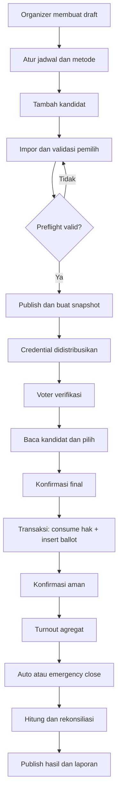
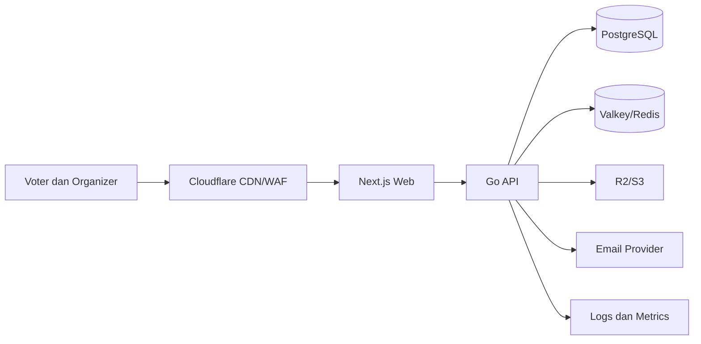

# One Voting — Product Discovery Document

**Versi:** 2.0

**Tanggal:** 29 Juli 2026

**Status:** siap dipakai sebagai dasar diskusi produk, UI/UX, dan perencanaan development

**Cakupan:** pemilihan internal skala kecil–menengah; bukan pemilu pemerintahan

> Cara membaca label: `[FAKTA]` berasal dari sumber yang dapat diperiksa; `[INSIGHT]` adalah kesimpulan analisis; `[ASUMSI]` belum dibuktikan kepada pengguna; `[REKOMENDASI]` adalah keputusan sementara; `[PERLU VALIDASI]` harus diuji melalui wawancara, usability test, atau pilot.

Dokumen ini memiliki dua lapis. Bagian 1–7 dapat dibaca oleh pengurus organisasi, dosen pembimbing, dan pengambil keputusan tanpa latar teknis. Bagian berikutnya menjelaskan bukti, desain produk, keamanan, dan konsekuensi development.

---

# Bagian I — Ringkasan Pengambil Keputusan

## 1. Tentang One Voting

One Voting adalah layanan web untuk menyelenggarakan pemilihan internal secara digital. Produk ini membantu panitia menyiapkan kandidat dan daftar pemilih, membuka pemungutan suara sesuai jadwal, memastikan setiap pemilih memakai haknya satu kali, menghitung hasil, serta menyediakan laporan proses.

Fokus awalnya adalah organisasi mahasiswa: himpunan, BEM, UKM, organisasi fakultas, dan pemilihan ketua kelas. Organisasi tersebut memiliki anggota yang jelas, pemilihan berulang, panitia yang berganti setiap periode, dan anggaran terbatas. Setelah pola ini terbukti, produk dapat diuji untuk sekolah, komunitas, asosiasi, perusahaan, organisasi non-profit, atau lingkungan warga.

One Voting tidak dirancang untuk pemilu nasional. Produk tidak menjanjikan keamanan absolut, tidak membuktikan identitas sipil, dan tidak menyelesaikan pemaksaan pilihan dari luar perangkat. Batas ini penting karena kebutuhan, risiko, regulasi, dan pembuktian untuk pemilu pemerintahan jauh lebih tinggi.

[REKOMENDASI] Posisi produk: sistem pemilihan internal yang mudah dijalankan panitia nonteknis, tetap menjaga kerahasiaan pilihan, dan menghasilkan bukti proses yang dapat diperiksa pengawas.

## 2. Mengapa Produk Ini Dibutuhkan

Panitia biasanya memilih satu dari tiga cara. Voting kertas mudah dipahami, tetapi membutuhkan lokasi, surat suara, petugas, daftar hadir, dan penghitungan manual. Form online lebih cepat disiapkan, tetapi merupakan alat pengumpulan jawaban umum. Platform e-voting khusus memiliki kontrol lebih lengkap, tetapi dapat terasa mahal atau terlalu rumit untuk organisasi kecil Indonesia.

Masalah sebenarnya bukan sekadar “voting belum online”. Panitia harus membuktikan bahwa orang yang memilih memang berhak, hak pilih tidak digunakan dua kali, pilihan tidak dapat dilihat panitia, aturan tidak berubah diam-diam, dan hasil berasal dari suara yang sah. Alat yang hanya mengumpulkan jawaban belum tentu menjawab lima kebutuhan tersebut sebagai satu proses.

[FAKTA] Dokumentasi Google Forms menunjukkan kemampuan membatasi satu respons, mengumpulkan email, mengatur akses, dan membagikan form. Kontrol tersebut berguna, tetapi dokumentasi yang diperiksa tidak menggambarkan pemisahan identitas dari suara, penguncian konfigurasi election, atau laporan audit khusus election. [FAKTA] Platform seperti ElectionBuddy, OpaVote, Election Runner, dan Simply Voting menawarkan voter list, ballot, jadwal, notifikasi, dan penghitungan dalam variasi yang berbeda. Kategori produk ini sudah nyata; peluang One Voting terletak pada kesederhanaan dan konteks lokal, bukan mengklaim menemukan e-voting.

## 3. Masalah yang Dipilih

**Problem statement utama:** Panitia organisasi mahasiswa kesulitan menjalankan pemilihan jarak jauh yang praktis dan dapat dipercaya karena daftar pemilih, akses voting, status hak pilih, kerahasiaan suara, perubahan aturan, dan bukti proses dikelola dengan alat atau prosedur yang terpisah. Akibatnya, panitia menghabiskan banyak waktu untuk pekerjaan manual dan hasil lebih mudah dipertanyakan.

Masalah ini dipecah menjadi lima prioritas:

1. **Kelayakan pemilih:** link atau akun umum tidak selalu sama dengan daftar anggota yang disahkan.
2. **Satu orang satu hak pilih:** retry, akun bersama, atau data ganda dapat menghasilkan suara ganda jika kontrol hanya berada di antarmuka.
3. **Kerahasiaan:** panitia tidak boleh memperoleh hubungan antara identitas pemilih dan kandidat yang dipilih.
4. **Integritas proses:** kandidat, jadwal, dan aturan tidak boleh berubah tanpa batas setelah voting dimulai.
5. **Bukti yang dapat diperiksa:** pengawas memerlukan catatan tindakan, rekonsiliasi jumlah, dan laporan, bukan akses ke pilihan pribadi.

[PERLU VALIDASI] Urutan tersebut berasal dari desk research dan threat modeling. Wawancara perlu memastikan apakah panitia dan pemilih mengalami masalah yang sama, seberapa sering, dan solusi apa yang sekarang mereka percaya.

## 4. Pengguna dan Pasar Awal

Pengguna utama terdiri dari panitia dan pemilih. Panitia membuat election, memasukkan kandidat, mengimpor pemilih, mempublikasikan jadwal, memonitor tingkat partisipasi, menutup voting, dan membuat laporan. Pemilih menerima akses, membaca informasi kandidat, memberikan suara, lalu memperoleh konfirmasi bahwa hak pilihnya tercatat.

Pengurus organisasi menjadi decision maker dan pembeli awal karena bertanggung jawab atas legitimasi kegiatan. Pengawas memerlukan akses read-only untuk memeriksa konfigurasi, kejadian administratif, serta hasil agregat. Kandidat membutuhkan informasi yang setara dan keyakinan bahwa aturan tidak berubah sepihak. Super Admin One Voting hanya menangani operasi platform dan tidak boleh membaca isi pilihan.

[REKOMENDASI] Beachhead market adalah organisasi mahasiswa Indonesia dengan 50–1.000 pemilih dan metode single-choice. Segmen ini cukup kecil untuk pilot, cukup sering mengadakan pemilihan, dan tidak membutuhkan procurement serumit institusi besar. Sekolah dan komunitas menjadi segmen kedua setelah workflow terbukti.

## 5. Solusi yang Diusulkan

One Voting mengelola satu election dari awal sampai akhir. Organizer membuat draft, mengatur jadwal, menambahkan kandidat, dan mengimpor daftar pemilih. Sistem memeriksa kelengkapan sebelum publish. Setelah voting dibuka, pemilih masuk dengan credential personal, melihat ballot, mengonfirmasi pilihan, dan mengirim suara.

Sistem memisahkan dua jenis catatan. Catatan pertama menyimpan identitas dan status “hak pilih sudah digunakan”. Catatan kedua menyimpan ballot tanpa identitas langsung. Pemisahan ini mencegah organizer membuka tabel yang menghubungkan nama dengan kandidat. Saat submit, sistem menandai hak pilih terpakai dan mencatat ballot dalam satu transaksi database agar retry tidak menghasilkan suara kedua.

Organizer melihat jumlah pemilih eligible, jumlah yang sudah menggunakan hak, persentase turnout, status, dan sisa waktu. Organizer tidak melihat perolehan kandidat saat election masih berjalan. Setelah ditutup, sistem menghitung hasil, melakukan rekonsiliasi, dan menyiapkan laporan serta audit event.

## 6. Keputusan MVP

MVP harus mampu menjalankan satu election single-choice yang rahasia dari draft sampai laporan. Fitur Must adalah:

- akun organizer dan satu workspace;
- draft election, jadwal, timezone, dan status;
- kandidat dengan nomor, nama, foto, serta visi-misi ringkas;
- input manual dan impor CSV pemilih dengan preview error;
- credential personal berentropi tinggi;
- halaman voting mobile-first;
- konfirmasi sebelum submit;
- transaksi vote atomik dan tahan retry;
- pemisahan identitas dari ballot;
- penguncian aturan setelah election dibuka;
- turnout agregat;
- penutupan otomatis dan emergency close dengan alasan;
- hasil setelah election ditutup;
- laporan CSV, rekonsiliasi, RBAC, dan audit event.

Email otomatis, reminder, PDF, branding, yes/no, multiple-choice, public result page, dan duplicate election ditempatkan pada V1.1. SSO kampus, custom domain, billing, ranked voting, proxy voting, native app, biometrik, blockchain, dan AI fraud detection tidak masuk MVP. MFA untuk akun organizer dan admin menjadi **gate keamanan pilot** berdasarkan risiko, bukan fitur upsell; recovery dan enrollment-nya harus diuji agar tidak mengunci panitia.

## 7. Risiko dan Langkah Berikutnya

Tiga risiko produk terbesar adalah pengguna tidak mau berpindah dari form yang gratis, credential dapat dibagikan, dan desain “identitas terpisah dari ballot” belum cukup dipercaya tanpa review independen. Risiko bisnis lainnya adalah frekuensi election rendah dan willingness-to-pay belum diketahui.

Langkah berikutnya bukan membangun semua fitur. Tim perlu mewawancarai 8–12 organizer, 12–20 voter, dan 4–6 pengurus atau pengawas. Prototype diuji kepada 5–8 orang per iterasi. Pilot low-stakes dijalankan kepada 50–200 pemilih setelah threat model, concurrency test, backup, dan incident runbook selesai.

Go decision untuk full development hanya diberikan bila organizer dapat menyelesaikan setup tanpa bantuan intensif, voter menyelesaikan vote kurang dari dua menit, mayoritas peserta memahami konfirmasi, rekonsiliasi tepat, dan tidak ada temuan keamanan kritis.

---

# Bagian II — Product Discovery

## 8. Metode dan Batas Riset

Riset menggunakan dokumentasi resmi produk, halaman harga vendor, dokumentasi Google dan Microsoft, OWASP, NIST, WCAG 2.2, regulasi Indonesia, publikasi akademik, dan beberapa studi kasus kampus Indonesia. Informasi vendor dianggap bukti bahwa vendor menerbitkan klaim tersebut, bukan audit independen atas implementasinya.

Analisis memakai stakeholder mapping, Jobs to Be Done, pain scoring, competitor matrix, MoSCoW, RICE relatif, threat modeling, dan assumption mapping. Angka frekuensi dan keparahan adalah alat prioritas analitis, bukan statistik nasional.

Batas bukti: belum ada wawancara One Voting, analytics, usability test, pilot, atau willingness-to-pay study. Studi dari satu kampus tidak digeneralisasi ke seluruh Indonesia. Harga dan fitur kompetitor dapat berubah. Temuan hukum bukan nasihat hukum.

## 9. Proses Voting Saat Ini

| Tahap | Kertas | Form umum | Platform election khusus |
|---|---|---|---|
| Daftar pemilih | daftar hadir | spreadsheet atau pembatas akun | voter list |
| Distribusi | hadir di lokasi | link | undangan atau credential personal |
| Verifikasi | kartu dan petugas | akun/email | token, ID, SSO, atau kombinasi |
| Memberi suara | surat suara | submit jawaban | ballot transaction |
| Monitoring | hitung hadir | jumlah respons | turnout tracker |
| Hasil | hitung manual | chart/spreadsheet | penghitungan terkonfigurasi |
| Audit | saksi dan berita acara | activity/version umum | log dan report khusus election |

Voting kertas memiliki bukti fisik dan mudah dipahami, tetapi tidak fleksibel untuk pemilih jarak jauh. Form umum mengurangi logistik, tetapi panitia harus menambahkan sendiri roster, lifecycle, SOP, dan laporan. Platform election khusus lebih sesuai domain, tetapi adopsi dipengaruhi harga, bahasa, pembayaran, kompleksitas, dan trust terhadap vendor.

[INSIGHT] Titik paling kritis adalah alur daftar pemilih → autentikasi → penggunaan hak pilih → ballot anonim. Empat langkah ini harus menjadi satu desain, bukan fitur terpisah.

## 10. Problem Statement

**Primary:** Panitia pemilihan organisasi mahasiswa mengalami kesulitan menyelenggarakan election jarak jauh yang dapat dipercaya ketika anggota memakai perangkat pribadi, karena eligibility, penggunaan hak, kerahasiaan ballot, lifecycle, dan bukti audit tersebar di banyak alat atau dikelola manual, sehingga operasional lambat dan hasil mudah disengketakan.

| Perspektif | Masalah | Dampak |
|---|---|---|
| Organizer | roster, undangan, status, dan hasil tidak berada dalam satu lifecycle | salah konfigurasi dan kerja manual |
| Voter | login atau submit ambigu | gagal memilih atau retry berulang |
| Kandidat | aturan dan ballot dapat berubah tanpa jejak | fairness dipertanyakan |
| Pengawas | tidak ada bukti berurutan yang read-only | sengketa sulit diperiksa |
| Pengurus | akses panitia terlalu luas dan retention kabur | risiko privasi dan reputasi |

Di luar MVP: identity proofing sipil, pencegahan coercion sepenuhnya, pemilu nasional, universal cryptographic verifiability, biometrik, weighted/proxy/ranked voting, integrasi pemerintah, dan offline voting penuh.

## 11. Target User dan Stakeholder

| Peran | Klasifikasi | Tujuan | Boleh melihat | Dilarang melihat |
|---|---|---|---|---|
| Election Organizer | primary user | menyiapkan dan menjalankan election | konfigurasi, roster sesuai peran, turnout | hubungan identitas–pilihan |
| Voter | end user | memakai satu hak pilih | ballot, status sendiri, hasil sesuai policy | roster dan status orang lain |
| Organization Admin | buyer/decision maker | governance dan pertanggungjawaban | anggota, policy, laporan | pilihan rahasia |
| Supervisor | supporting user | review proses | konfigurasi read-only, audit, hasil agregat | pilihan per identitas |
| Candidate | secondary user | perlakuan informasi yang setara | profil dan hasil | roster sensitif |
| Super Admin | platform operator | operasi dan incident handling | metadata minimum | token plaintext dan ballot |
| Public Viewer | optional | melihat hasil publik | hasil yang dipublish | data internal |

Least privilege berlaku pada setiap peran. Akses diberikan hanya untuk tugas yang sah, dibatasi waktu bila perlu, dan dicatat pada audit event.

## 12. Persona dan Jobs to Be Done

**Nabila, 20, ketua panitia.** Ia mengelola 620 pemilih menggunakan laptop Windows dan Android. Ia takut CSV salah dan election terpublikasi sebelum siap. *When I menyiapkan election dengan waktu terbatas, I want to memvalidasi roster dan aturan sebelum publish, so I can mencegah kesalahan saat voting berjalan.*

**Rizky, 19, voter.** Ia membuka link dari grup chat melalui Android murah dengan koneksi berubah. *When I memilih lewat HP, I want to mendapat status submit yang tegas, so I can yakin suara tercatat tanpa mengirim dua kali.*

**Dimas, 23, ketua organisasi.** Ia harus menyerahkan arsip pergantian pengurus. *When I mempertanggungjawabkan election, I want laporan proses dan hasil yang konsisten, so I can menjelaskan legitimasi pengurus terpilih.*

**Sari, 22, pengawas.** Ia membandingkan aturan, waktu, dan hasil tanpa menjalankan election. *When I mengawasi election, I want konfigurasi terkunci dan catatan administratif read-only, so I can menilai kepatuhan tanpa akses ke pilihan pribadi.*

## 13. Pain Points dan Prioritas

| Prioritas | Pain point | Frekuensi | Dampak | Skor | Keputusan |
|---:|---|---:|---:|---:|---|
| 1 | pemilih tidak terverifikasi atau link bocor | 4 | 5 | 20 | roster-bound credential |
| 2 | duplicate vote | 4 | 5 | 20 | constraint + transaksi + idempotency |
| 3 | hasil atau aturan diragukan | 4 | 5 | 20 | lifecycle lock + audit |
| 4 | admin melihat identitas dan pilihan | 3 | 5 | 15 | pemisahan data |
| 5 | tidak ada audit/reconciliation | 3 | 5 | 15 | event append-only + report |
| 6 | CSV roster kotor | 4 | 4 | 16 | dry-run import |
| 7 | mobile tidak nyaman | 4 | 4 | 16 | mobile-first UI |
| 8 | koneksi putus saat submit | 3 | 5 | 15 | idempotent retry |

[ASUMSI] Skor harus dikalibrasi dengan pengalaman election nyata. Reminder dan branding mungkin membantu adopsi, tetapi tidak boleh menggeser fitur integritas dari MVP.

## 14. Existing Solutions

**Kertas** cocok ketika pemilih berada di satu tempat dan organisasi siap menyediakan petugas. Kekurangannya adalah logistik, waktu hitung, kerusakan surat, dan akses jarak jauh.

**Google Forms atau Microsoft Forms** cepat dan familiar. Pembatasan respons serta kontrol akun membantu polling sederhana. Namun, organisasi tetap harus merancang roster, secret ballot policy, lifecycle, audit, dan incident handling sendiri.

**Polling chat** tepat untuk keputusan informal, bukan election yang membutuhkan eligibility dan bukti formal. **Form buatan panitia** fleksibel, tetapi pengetahuan keamanan hilang ketika kepengurusan berganti. **Platform election khusus** memiliki fitur domain lebih lengkap, tetapi belum tentu cocok dengan anggaran, bahasa, dan proses lokal.

## 15. Competitor Analysis

| Produk | Kekuatan yang ditemukan | Batas bukti / peluang One Voting |
|---|---|---|
| ElectionBuddy | banyak metode ballot, voter list, key personal, reminders, hasil dapat disembunyikan | fitur luas dapat berlebihan; detail independensi audit perlu dibedakan dari klaim vendor |
| Simply Voting | self-administered dan managed election, beberapa kanal, pricing menurut eligible voter | harga final dan detail aksesibilitas memerlukan pemeriksaan saat pembelian |
| OpaVote | gratis ≤25 voter/10 kandidat; pay-as-you-go $10 per 125 voter atau 20 kandidat; ranked methods dan anonymous option | banyak metode hitung bukan kebutuhan MVP awal; klaim anonimitas adalah klaim vendor |
| Election Runner | target sekolah/organisasi, harga publik $0 ≤20 hingga $90 ≤1.000 saat akses, voter ID/key, candidate profile | unlinkability dan bentuk audit export perlu dikonfirmasi |
| Google Forms | familiar, murah, satu respons, kontrol akses | bukan workflow election end-to-end |
| Voting kertas | observasi fisik dan mudah dipahami | logistik, remote access, hitung manual |

Tidak ada dasar untuk menyebut One Voting lebih aman sebelum implementation review dan pilot. Diferensiasi yang realistis adalah Bahasa Indonesia, setup terpandu, roster lokal, mobile-first, harga terjangkau, dan laporan yang mudah dijelaskan.

## 16. Market Gap dan Positioning

Market gap berada di antara form umum yang mudah tetapi tidak election-specific dan platform global yang lengkap tetapi terasa tidak proporsional untuk organisasi kecil. One Voting harus menghindari perlombaan jumlah fitur.

**Positioning statement:** Untuk organisasi mahasiswa Indonesia yang perlu menjalankan pemilihan internal tanpa tim teknis, One Voting adalah platform election berbasis web yang menyatukan roster, ballot rahasia, lifecycle, hasil, dan laporan. Berbeda dari form umum, One Voting membatasi hak pilih dan tindakan admin sebagai bagian dari proses election.

[PERLU VALIDASI] Bahasa Indonesia dan harga IDR belum cukup sebagai moat. Retention dapat rendah karena election jarang. Produk perlu menguji paket per-election, freemium untuk pilot kecil, dan subscription organisasi tanpa mengunci model sebelum value terbukti.

## 17. Solution Hypothesis

**Primary:** We believe that wizard election end-to-end dengan roster validation, credential personal, secret ballot separation, lifecycle lock, dan report untuk organizer ormawa akan memungkinkan election diluncurkan mandiri dan mengurangi sengketa. Hipotesis diterima bila ≥80% organizer test menyelesaikan setup tanpa fasilitator dalam median ≤30 menit.

**Voter:** alur mobile dan submit idempotent diterima bila ≥95% peserta pilot menyelesaikan vote, median ≤2 menit, dan ≥80% yakin suara tercatat.

**Security/trust:** pemisahan data dan audit diterima bila architecture review tidak menemukan critical issue dan rekonsiliasi pilot tepat. **Participation:** akses lebih praktis belum boleh diklaim menaikkan turnout tanpa baseline yang sebanding.

Hipotesis ditolak atau diubah bila organizer tetap memilih form karena proses baru lebih berat, voter gagal memahami credential, atau pengawas menganggap laporan tidak cukup.

## 18. Assumption Mapping

| Asumsi | Jenis | Penting | Tidak pasti | Uji |
|---|---|---:|---:|---|
| panitia mau berpindah dari form | desirability | 5 | 5 | wawancara + prototype |
| credential personal cukup untuk risiko awal | security | 5 | 5 | abuse test + pilot |
| separation model dipercaya | feasibility/trust | 5 | 4 | architecture review |
| organisasi mau membayar | viability | 4 | 5 | pricing interview |
| single-choice mencakup mayoritas kasus awal | desirability | 4 | 4 | sampel election terdahulu |
| notice dan retention dapat distandardisasi | legal/privacy | 5 | 4 | review DPO/legal |

Tiga asumsi paling berisiko divalidasi sebelum full build: willingness to switch, ketahanan credential terhadap sharing, dan kepercayaan terhadap pemisahan identitas–ballot.

---

# Bagian III — Definisi Produk

## 19. Prinsip Produk

1. **Mudah tanpa menyembunyikan konsekuensi.** Wizard menjelaskan keputusan yang tidak dapat diubah.
2. **Secret by design.** Organizer tidak memiliki query atau layar identity-to-choice.
3. **Safe retry.** Koneksi putus tidak menghasilkan suara kedua.
4. **Lifecycle jelas.** Draft, scheduled, open, closed, cancelled, dan archived memiliki aturan eksplisit.
5. **Least privilege.** Setiap peran hanya memperoleh akses yang dibutuhkan.
6. **Evidence, not surveillance.** Audit menjelaskan tindakan admin tanpa mencatat pilihan.
7. **Mobile dan aksesibel.** Hak pilih tidak boleh hilang karena layout atau interaksi yang buruk.
8. **Tidak mengklaim 100% aman.** Residual risk dan trade-off dijelaskan.

## 20. Alur Election End-to-End

Alternative flow mencakup input voter manual, result private, abstain, dan emergency close. Error flow mencakup token invalid, belum mulai, sudah selesai, sudah memilih, CSV invalid, kandidat kosong, koneksi putus, edit terlarang, dan count mismatch. Count mismatch memblokir publikasi hasil dan membuka incident state.

## 21. Scope MVP V1

| Domain | Fitur V1 | Alasan |
|---|---|---|
| Organizer | account, workspace, role | ownership dan akses |
| Election | draft, schedule, single-choice, status | lifecycle minimum |
| Candidate | nomor, nama, foto, visi-misi | informed choice |
| Voter | manual/CSV, validation, revoke pre-start | eligibility |
| Access | one-time high-entropy credential | duplicate prevention |
| Voting | mobile ballot, confirm, idempotent submit | completion dan retry |
| Monitoring | eligible, used, turnout, time | operasi tanpa live result |
| Results | deterministic count, reconciliation, CSV | pertanggungjawaban |
| Security | RBAC, rate limit, audit, backup | trust baseline |

MVP bukan demo greybox. Ia harus menangani satu election nyata low-stakes, termasuk kegagalan impor, retry, close, backup, dan laporan.

## 22. Post-MVP dan Future Scope

**V1.1:** email verification dan invitation, reminder, resend, PDF report, branding dasar, duplicate election, voter groups, yes/no, multiple-choice, public result page, archive/retention UI, serta supervisor attestation.

**Future:** SSO kampus, custom domain, white-label, billing, multilingual, ranked/weighted/proxy vote, API SIS, cryptographic verifiability research, multi-region, dan native mobile app.

Blockchain, biometric recognition, government integration, cryptocurrency, dan advanced AI fraud detection tidak memiliki bukti kebutuhan untuk beachhead market. Fitur tersebut hanya dipertimbangkan jika problem evidence, review etis, dan legal basis tersedia.

## 23. Feature Prioritization

| Feature | MoSCoW | Problem | Metric utama |
|---|---|---|---|
| lifecycle dan lock | Must | perubahan aturan | forbidden edit incidents |
| CSV validation | Must | roster kotor | import success |
| one-time credential | Must | eligibility | auth success / abuse attempts |
| atomic idempotent vote | Must | duplicate/retry | duplicate committed ballots = 0 |
| identity–ballot separation | Must | privacy | prohibited relationship unavailable |
| turnout aggregate | Must | monitoring | dashboard freshness |
| result + reconciliation | Must | trust | unexplained mismatch = 0 |
| audit event | Must | dispute | critical actions covered |
| reminder | Should | jadwal terlewat | uplift comparable cohort |
| branding | Could | identity organisasi | adoption feedback |
| ranked/biometric/blockchain | Won't now | belum terbukti | tidak dinilai |

RICE digunakan sebagai pembanding relatif, bukan angka ilmiah. Fitur keamanan inti tidak boleh kalah hanya karena reach terlihat lebih kecil.

## 24. User Stories dan Acceptance Criteria

- **Organizer membuat election.** Given organizer berwenang, when draft valid disimpan, then election berstatus draft dan event creation tercatat.
- **Organizer impor roster.** Given CSV dipilih, when dry-run selesai, then baris valid dan error ditampilkan tanpa commit otomatis.
- **Organizer publish.** Given preflight lulus, when publish dikonfirmasi, then snapshot immutable dibuat dan status menjadi scheduled/open.
- **Voter autentikasi.** Given credential valid dan belum dipakai, when dikirim, then limited ballot session diterbitkan dan credential mentah tidak dicatat.
- **Voter submit.** Given session valid, when pilihan dikonfirmasi, then satu transaksi memakai entitlement dan memasukkan satu ballot.
- **Retry.** Given request sudah committed, when idempotency key sama dikirim lagi, then respons sukses sama dikembalikan tanpa ballot tambahan.
- **Organizer close.** Given organizer berwenang, when close dengan alasan, then ballot baru ditolak dan event tercatat.
- **Supervisor audit.** Given supervisor ditugaskan, when log dibuka, then ia melihat event berurutan tanpa pilihan atau token rahasia.

## 25. Role dan Permission

| Aksi | Org Admin | Organizer | Supervisor | Candidate | Voter | Public |
|---|---:|---:|---:|---:|---:|---:|
| create election | ✓ | ✓ |  |  |  |  |
| edit draft | ✓ | ✓ | view | profile sendiri* |  |  |
| publish/close | policy | ✓ | view |  |  |  |
| import voter | policy | ✓ |  |  |  |  |
| view voter identity | scoped | scoped | policy |  | diri sendiri |  |
| view selected candidate per voter | **tidak** | **tidak** | **tidak** | **tidak** | diri sendiri saat memilih | **tidak** |
| view turnout | ✓ | ✓ | ✓ | policy |  |  |
| view result | ✓ | ✓ | ✓ | ✓ | policy | jika dipublish |
| view audit | ✓ | ✓ | ✓ |  |  |  |
| billing/member | ✓ |  |  |  |  |  |

`*` Candidate self-edit dipertimbangkan setelah workflow approval tersedia. MVP dapat meminta organizer memasukkan profil untuk mengurangi permission surface.

## 26. Success Metrics

**North Star:** Completed Trusted Elections, yaitu election yang selesai, direkonsiliasi tanpa mismatch yang tidak dijelaskan, tidak mengalami insiden kritis, dan laporan diterima organizer/pengawas.

Product metrics: setup completion, time to launch, voting completion, median vote time, turnout, organizer retention. UX metrics: authentication success, error recovery, confidence vote recorded, SUS/task success. Security metrics: duplicate attempts, unauthorized admin attempts, critical incidents, reconciliation mismatch. Operational metrics: uptime selama window, API latency, email delivery, recovery time. Business metrics baru diprioritaskan setelah value terbukti.

Target pilot: ≥95% voting completion, median vote ≤2 menit, ≥80% voter yakin tercatat, setup median ≤30 menit, zero duplicate committed ballot, zero unexplained mismatch, dan zero critical security incident.

---

# Bagian IV — Keamanan dan Teknis

## 27. Model Kerahasiaan Suara

“Kerahasiaan” berarti organizer tidak dapat mengambil hubungan langsung antara nama pemilih dan kandidat. Sistem tetap perlu mengetahui apakah seseorang eligible dan sudah menggunakan haknya. Karena itu, data dibagi menjadi **identity/entitlement store** dan **ballot store**.

Entitlement adalah hak teknis untuk memberikan satu suara. Setelah digunakan, record hanya menyimpan status dan waktu. Ballot menyimpan selection dan election snapshot, tanpa `user_id` atau `voter_id` langsung. Korelasi waktu dan data kecil masih dapat menimbulkan risiko reidentifikasi; akses log, timestamp precision, dan export harus dibatasi.

Receipt hanya membuktikan request diterima atau status tercatat. Receipt tidak boleh mengandung kandidat atau bukti yang dapat dipakai menjual/memaksakan suara. Sistem ini meningkatkan kerahasiaan operasional, tetapi tidak mengklaim end-to-end cryptographic anonymity.

## 28. Risiko Keamanan dan Mitigasi

| Threat | Dampak | Mitigasi MVP |
|---|---|---|
| duplicate vote | hasil invalid | unique constraint, transaction, idempotency |
| token sharing | pihak lain memakai hak | entropy, expiry, optional second identifier, revoke |
| brute force | unauthorized access | rate limit, generic response, monitoring |
| admin takeover | perubahan election/data | MFA admin, RBAC, session hardening, audit |
| SQL injection | data bocor/manipulasi | parameterized query, validation, least privilege |
| XSS/CSRF | session/action abuse | output encoding, CSP, CSRF token, SameSite cookie |
| edit setelah open | fairness rusak | immutable snapshot dan state guard |
| vote interruption | status ambigu | idempotency dan status endpoint |
| audit modification | bukti rusak | append-only policy, restricted role, external backup |
| DDoS | election tidak tersedia | CDN/WAF, rate limit, capacity/load test, runbook |

Insider threat tidak hilang hanya dengan RBAC. Privileged action memerlukan alasan, event, dan review. Backup harus diuji restore. Log dilarang menyimpan password, token mentah, ballot choice, atau relasi identitas–pilihan.

## 29. Privasi dan UU PDP

[FAKTA] UU No. 27 Tahun 2022 mengatur data pribadi, hak subjek, pemrosesan, serta kewajiban pengendali dan prosesor. Roster dapat memuat nama, email, NIM/member ID, dan status penggunaan hak. One Voting perlu mendokumentasikan tujuan, dasar pemrosesan, pihak yang mengakses, retention, penghapusan, serta incident response.

Data minimization: jangan meminta NIK, alamat, tanggal lahir, atau data biometrik bila roster organisasi cukup. Contact data dan status turnout tidak boleh dibuka lebih luas dari kebutuhan operasional. Pemilih menerima privacy notice sebelum menggunakan layanan. Organisasi dan One Voting perlu mendefinisikan peran pengendali/prosesor dalam kontrak.

[PERLU VALIDASI] Retention default, mekanisme permintaan subjek data, dan dasar hukum untuk tiap segmen memerlukan review penasihat hukum/DPO Indonesia. Penghapusan identity record harus mempertahankan integritas laporan tanpa membuka ballot.

## 30. Arsitektur Teknis yang Direkomendasikan

Rekomendasi awal, bukan keputusan final:

Frontend: Next.js, TypeScript, Tailwind, shadcn/ui, React Hook Form, Zod. Backend: Go dengan Chi, pgx, sqlc, dan Goose. PostgreSQL dipilih untuk transaksi, constraint, locking, backup, serta concurrency test yang matang. Redis/Valkey dipakai hanya bila rate limit/job benar-benar membutuhkan.

Alternatif tim TypeScript: Fastify + PostgreSQL + Drizzle. Prinsip transaksional lebih penting daripada bahasa. Voting transaction tidak boleh bergantung pada validasi client atau Server Action tanpa constraint database. Pilihan stack memerlukan Architecture Decision Record terpisah; PDD hanya menetapkan kebutuhan authority, transaction, recovery, secrecy boundary, dan auditability.

## 31. Data Model Konseptual

Identity domain: `users`, `organizations`, `memberships`, `elections`, `voter_roster`, `voter_entitlements`, dan `credential_hashes`.

Ballot domain: `election_snapshots`, `ballots`, `ballot_selections`, dan `vote_receipts`. Ballot tidak memiliki foreign key langsung ke user atau roster.

Governance domain: `roles`, `role_assignments`, `audit_events`, `result_snapshots`, `exports`, dan `incidents`.

Constraint penting: satu normalized voter per election, satu entitlement per voter, entitlement hanya berubah unused→used, idempotency key unik per election/session, candidate harus berasal dari snapshot aktif, dan ballot ditolak di luar window. Audit event memuat actor, action, target, timestamp, reason, dan correlation ID tanpa choice.

## 32. Transaksi Vote dan Idempotency

Idempotency berarti request yang sama dapat dikirim ulang tanpa menciptakan efek kedua. Mobile network sering memutus koneksi setelah server berhasil menyimpan suara tetapi sebelum browser menerima respons. Tanpa idempotency, voter dapat menekan lagi dan menciptakan ketidakpastian.

Alur server:

1. validasi limited ballot session, payload, dan election status;
2. baca/lock entitlement;
3. periksa idempotency key;
4. validasi candidate snapshot;
5. insert anonymous ballot;
6. ubah entitlement menjadi used hanya jika sebelumnya unused;
7. simpan receipt non-revealing;
8. commit;
9. retry key dan payload yang sama mengembalikan hasil yang sama; key sama dengan payload berbeda ditolak;
10. bila close dan cast berlomba, aturan transaksi menentukan satu hasil final yang dapat direkonsiliasi.

Semua langkah 2–8 berada dalam satu transaksi PostgreSQL. Unique constraint tetap menjadi pertahanan terakhir. Test wajib mengirim ≥100 request paralel pada entitlement sama dan membuktikan hanya satu ballot committed.

## 33. Non-Functional Requirements

- Availability target pilot ditetapkan per election window; maintenance dilarang saat active window.
- p95 API read <500 ms dan vote submit <1.500 ms pada kapasitas pilot, tidak termasuk jaringan pengguna.
- UI mendukung viewport 320 px, keyboard, focus visible, semantic form, error association, dan contrast menuju WCAG 2.2 AA.
- Semua koneksi publik HTTPS; secret dikelola di secret manager; password memakai Argon2id/bcrypt sesuai parameter review.
- Backup terenkripsi, off-host, dengan restore drill sebelum pilot.
- Observability mencakup latency, error, auth failures, queue/email, transaction conflict, dan audit integrity tanpa sensitive payload.
- RPO/RTO pilot ditentukan sebelum go-live; target awal RPO ≤15 menit dan RTO ≤2 jam perlu diuji.
- Deployment memiliki rollback, migration safety, health check, dan incident communication.

---

# Bagian V — Validasi dan Eksekusi

## 34. Validation Plan

Tujuan riset primer adalah membuktikan masalah, bukan mencari persetujuan terhadap aplikasi. Organizer ditanya tentang election terakhir: roster, tools, kegagalan, waktu kerja, sengketa, dan biaya. Voter ditanya kapan terakhir memilih, perangkat, login, keraguan, kegagalan submit, dan privasi. Pengurus/pengawas diminta menunjukkan laporan atau bukti yang mereka anggap cukup.

Sampel: 8–12 organizer dari beberapa organisasi, 12–20 voter dengan variasi perangkat/koneksi, dan 4–6 pengurus/pengawas. Prototype test memakai 5–8 peserta per iterasi. Data dikodekan berdasarkan pola, severity, workaround, dan willingness to switch; bukan dihitung sebagai statistik populasi.

Kriteria lanjut: problem berulang pada beberapa organisasi, workaround memakan waktu/menurunkan trust, dan prototype setup/vote dapat diselesaikan. Ubah arah jika kebutuhan utama ternyata komunikasi/roster saja. Hentikan jika target tidak menganggap trust problem penting atau solusi menambah beban tanpa benefit.

## 35. Rencana Pilot

Pilot pertama harus low-stakes, misalnya pemilihan keputusan internal atau ketua kelas, bukan election dengan konflik tinggi. Populasi 50–200 pemilih, satu metode, window singkat tetapi realistis, dan fallback tertulis.

Sebelum pilot: threat model review, data-flow review, load/concurrency test, backup-restore, role test, accessibility test, incident tabletop, consent/privacy notice, serta dry-run panitia. Saat pilot: observability, support channel, incident commander, dan larangan perubahan langsung tanpa runbook. Sesudah pilot: reconciliation, anonymized analytics, interview, incident review, dan keputusan go/no-go.

Tidak boleh memakai pilihan voter asli untuk debugging. Test data digunakan untuk diagnosis teknis; production incident mengikuti akses terbatas dan audit.

## 36. Roadmap Development

**Gate 0 — Discovery:** wawancara, process map, prototype, threat model awal. **Gate 1 — Foundation:** auth organizer, organization, RBAC, election lifecycle, migrations, audit foundation. **Gate 2 — Setup:** candidate dan roster import dengan preflight. **Gate 3 — Voting core:** credential, ballot session, transaction, idempotency, separation. **Gate 4 — Operations:** turnout, close, results, reconciliation, export, backup. **Gate 5 — Pilot hardening:** accessibility, load, security review, runbook, telemetry.

Setiap gate selesai hanya bila acceptance test lulus. UI polish tidak menggantikan transaction test. Fitur V1.1 tidak dimulai sebelum pilot menghasilkan evidence.

## 37. Go/No-Go Criteria

**Go ke pilot** bila: prototype task success ≥80%; core transaction test lulus; zero critical security finding; backup restore berhasil; organizer memahami irreversible actions; accessibility blocker selesai; privacy notice dan role jelas.

**Go ke broader development** bila: voting completion ≥95%; zero duplicate committed ballot; zero unexplained reconciliation mismatch; median vote ≤2 menit; ≥80% voter yakin tercatat; organizer setup median ≤30 menit; pengawas menerima laporan; support load dapat ditangani.

**No-go/pause** bila ada critical vulnerability, identity-choice exposure, count mismatch, recurring lockout, organizer memerlukan bantuan intensif, atau evidence menunjukkan masalah bukan prioritas. No-go bukan kegagalan; ia mencegah biaya dan risiko bertambah.

## 38. Open Questions

1. Metode credential apa yang diterima kampus: email, NIM+token, atau organizer-distributed token?
2. Apakah organizer boleh melihat daftar “belum memilih”, dan kapan?
3. Berapa retention roster, status, audit, dan hasil?
4. Siapa pengendali dan prosesor data pada model SaaS?
5. Apakah abstain wajib?
6. Apakah pasangan kandidat dimodelkan sebagai satu entry?
7. Siapa berwenang emergency close dan apakah reopen pernah diizinkan?
8. Apakah hasil harus menunggu approval supervisor?
9. Model harga mana yang dipahami organisasi: per-election atau subscription?
10. Apa fallback bila email atau internet bermasalah?
11. Evidence apa yang kandidat anggap cukup untuk sengketa?
12. Apakah single-choice mencakup mayoritas election awal?

## 39. Rekomendasi Akhir

Bangun One Voting hanya setelah masalah dan willingness to switch terbukti. Mulai dari satu segmen, satu metode ballot, dan satu workflow end-to-end. Prioritaskan roster, one-person-one-vote, secret ballot separation, lifecycle lock, serta reconciliation. Tunda breadth fitur.

Gunakan prototype untuk mengurangi risiko desirability; gunakan threat model, transaction test, dan review untuk feasibility/security; gunakan pricing interview untuk viability; gunakan review legal/DPO untuk privacy. Keempat risiko harus bergerak bersama.

Dokumen ini siap menjadi dasar PRD dan technical design, tetapi bukan pengganti wawancara, legal review, security review, atau pilot. Keputusan yang diberi label asumsi harus tetap terlihat pada backlog dan risk register.

## 40. Referensi dan Lampiran

Tanggal akses sumber v2: **29 Juli 2026**. Ledger rinci disimpan pada dokumen sumber PDD v2 dan riset pendukung. Sumber utama yang memengaruhi keputusan:

- Google, *Publish & share your form with responders*: https://support.google.com/docs/answer/2839588
- Microsoft Support, *Adjust your form or quiz settings*: https://support.microsoft.com/office/f255a4ba-e03c-4e12-b880-f7e8b62e0665
- ElectionBuddy, *Features*: https://electionbuddy.com/features/
- Simply Voting, *Internet Voting*: https://www.simplyvoting.com/internet-voting/
- OpaVote, *Online Elections*: https://opavote.com/
- Election Runner, *Online Elections*: https://electionrunner.com/
- OWASP, *Application Security Verification Standard 5.0.0*: https://owasp.org/www-project-application-security-verification-standard/
- OWASP, *Authentication Cheat Sheet*: https://cheatsheetseries.owasp.org/cheatsheets/Authentication_Cheat_Sheet.html
- NIST, *SP 800-63B-4 Authentication and Authenticator Management*: https://pages.nist.gov/800-63-4/sp800-63b.html
- NIST, *Cybersecurity Framework Election Infrastructure Profile*: https://doi.org/10.6028/NIST.IR.8310
- W3C, *Web Content Accessibility Guidelines 2.2*: https://www.w3.org/TR/WCAG22/
- BPK RI, *UU No. 27 Tahun 2022 tentang Pelindungan Data Pribadi*: https://peraturan.bpk.go.id/Details/229798/uu-no-27-tahun-2022
- Helios Voting, dokumentasi dan publikasi: https://vote.heliosvoting.org/
- National Academies, *Securing the Vote*: https://nap.nationalacademies.org/catalog/25120/securing-the-vote-protecting-american-democracy
- Source ledger PDD v2: [`sources/product-discovery-v2-sources.md`](./sources/product-discovery-v2-sources.md)

Lampiran web:

- [Research Plan](./research-plan.md)
- [Competitor Research](./competitor-research.md)
- [Security & Privacy Research](./security-privacy-research.md)
- [Product Discovery v1 — Arsip](./product-discovery-v1-archive.md)

### Panduan Wawancara Organizer

Gunakan pertanyaan berbasis pengalaman masa lalu. Jangan membuka wawancara dengan menjelaskan fitur One Voting.

1. Ceritakan pemilihan terakhir yang Anda kelola dari persiapan sampai hasil diumumkan.
2. Siapa yang menetapkan daftar pemilih dan bagaimana daftar itu disahkan?
3. Berapa kali daftar berubah setelah persiapan dimulai? Apa penyebabnya?
4. Alat apa saja yang digunakan panitia dan mengapa memilih alat tersebut?
5. Bagian mana yang paling banyak memakan waktu panitia?
6. Ceritakan kesalahan atau kejadian tidak terduga yang pernah terjadi.
7. Bagaimana panitia memastikan seseorang hanya memilih satu kali?
8. Bagaimana panitia menangani orang yang merasa berhak tetapi tidak dapat memilih?
9. Siapa yang dapat membuka data pemilih dan hasil mentah?
10. Apa yang dapat dilihat panitia tentang status seorang pemilih?
11. Bagaimana kandidat atau pengawas memeriksa bahwa proses berjalan sesuai aturan?
12. Pernahkah hasil atau proses dipertanyakan? Bukti apa yang diminta?
13. Apa yang dilakukan jika sistem, form, atau koneksi bermasalah ketika voting berlangsung?
14. Berapa lama panitia menyiapkan election dan menghitung hasil?
15. Biaya apa yang keluar, termasuk waktu, cetak, ruang, komunikasi, dan dukungan teknis?
16. Apa alasan panitia memilih kertas, form, atau platform khusus?
17. Apa yang membuat Anda menolak mengganti proses yang sekarang?
18. Bagian mana yang tidak boleh otomatis karena memerlukan keputusan manusia?
19. Berapa lama data pemilih dan hasil biasanya disimpan? Siapa yang memutuskan?
20. Jika hanya satu masalah dapat diperbaiki pada election berikutnya, masalah apa yang Anda pilih?

### Panduan Wawancara Voter

1. Ceritakan pemilihan organisasi terakhir yang Anda ikuti.
2. Dari mana Anda mengetahui jadwal dan memperoleh akses voting?
3. Perangkat dan koneksi apa yang Anda gunakan?
4. Apa yang terjadi sejak membuka link sampai selesai memilih?
5. Bagian mana yang membuat Anda ragu atau berhenti?
6. Pernahkah Anda gagal login atau dianggap tidak terdaftar? Apa yang Anda lakukan?
7. Pernahkah submit terasa menggantung atau koneksi terputus?
8. Setelah submit, apa yang membuat Anda yakin suara tercatat?
9. Informasi apa yang Anda baca sebelum memilih kandidat?
10. Seberapa yakin pilihan Anda tidak dapat dilihat panitia? Mengapa?
11. Data apa yang wajar diminta untuk memverifikasi hak pilih?
12. Data apa yang tidak bersedia Anda berikan?
13. Bagaimana jika credential voting dikirim melalui grup atau diteruskan ke orang lain?
14. Apa yang Anda harapkan ketika salah memilih sebelum konfirmasi final?
15. Apakah hasil perlu terlihat saat voting masih berjalan? Mengapa?
16. Bantuan seperti apa yang Anda butuhkan jika akses gagal?
17. Apakah Anda pernah tidak ikut karena prosesnya sulit? Ceritakan situasinya.
18. Berapa lama proses voting yang masih terasa wajar?
19. Apa yang membuat Anda lebih percaya pada voting kertas dibanding digital, atau sebaliknya?
20. Bukti apa yang cukup tanpa mengungkap kandidat pilihan Anda?

### Checklist Preflight Election

Sebelum publish, sistem dan organizer memeriksa:

- nama, deskripsi, timezone, waktu mulai, dan waktu selesai valid;
- metode ballot sesuai aturan dan hanya single-choice untuk MVP;
- semua kandidat memiliki nomor unik, nama, dan informasi minimum;
- urutan kandidat telah disetujui;
- roster selesai diimpor, duplicate identifier diselesaikan, dan jumlah eligible disahkan;
- tidak ada credential plaintext di log atau export yang tidak perlu;
- result visibility dan kebijakan abstain dipilih secara eksplisit;
- organizer, organization admin, dan supervisor telah ditetapkan;
- emergency contact dan incident commander tersedia;
- privacy notice dan aturan election dapat dibuka pemilih;
- preview mobile dan keyboard test lulus;
- snapshot konfigurasi dibuat saat publish;
- perubahan setelah publish mengikuti aturan lifecycle;
- metode distribusi credential dan recovery telah diuji;
- backup, observability, dan status page siap sebelum window dibuka.

### Checklist Evaluasi Pilot

Setelah pilot, tim mencatat:

- eligible voter, successful authentication, completed ballot, abstain, dan failure count;
- median dan p95 waktu autentikasi serta submit;
- retry count, duplicate attempt, transaction conflict, dan error recovery;
- jumlah support request serta kategorinya;
- perangkat, browser, dan kondisi jaringan pada kegagalan;
- reconciliation antara used entitlement dan ballot;
- seluruh privileged action dan alasan emergency action;
- hasil restore drill dan backup integrity;
- task success organizer serta waktu setup;
- confidence voter bahwa suara tercatat dan tetap rahasia;
- penilaian supervisor terhadap laporan;
- temuan accessibility dan security;
- keputusan fitur yang dipertahankan, diubah, ditunda, atau dihapus;
- residual risk yang diterima oleh pemilik kegiatan;
- keputusan go, limited-go, repeat-pilot, atau no-go.

### Glosarium

- **Election:** satu kegiatan pemilihan dengan aturan, kandidat, roster, jadwal, dan hasil tertentu.
- **Roster:** daftar orang yang ditetapkan berhak memilih.
- **Eligibility:** kondisi yang menentukan seseorang berhak mengikuti election.
- **Entitlement:** record teknis bahwa satu voter memiliki satu hak yang belum atau sudah digunakan.
- **Credential:** rahasia atau identitas terbatas yang dipakai untuk memperoleh ballot session.
- **Ballot:** representasi suara tanpa identitas langsung pemilih.
- **Ballot session:** sesi singkat dengan kewenangan terbatas untuk membaca dan mengirim ballot.
- **Election snapshot:** salinan aturan dan kandidat yang dikunci untuk election berjalan.
- **Turnout:** persentase hak pilih yang telah digunakan, bukan perolehan kandidat.
- **Idempotency key:** pengenal request yang membuat retry menghasilkan efek yang sama, bukan efek tambahan.
- **Atomic transaction:** sekumpulan perubahan database yang seluruhnya berhasil atau seluruhnya dibatalkan.
- **Reconciliation:** pemeriksaan bahwa jumlah entitlement terpakai, ballot, abstain, dan pengecualian konsisten.
- **Audit event:** catatan tindakan administratif yang memuat pelaku, aksi, waktu, target, dan alasan tanpa choice.
- **Append-only:** catatan baru dapat ditambahkan, tetapi catatan lama tidak diedit melalui operasi normal.
- **RBAC:** pemberian akses berdasarkan peran.
- **Least privilege:** setiap pengguna menerima akses minimum untuk tugasnya.
- **Rate limiting:** pembatasan jumlah request untuk mengurangi brute force dan penyalahgunaan.
- **Residual risk:** risiko yang masih ada setelah mitigasi diterapkan.
- **RPO:** batas kehilangan data yang dapat diterima setelah insiden.
- **RTO:** batas waktu pemulihan layanan yang ditargetkan.

### Traceability Ringkas

| Problem | Pain point | Hypothesis | Fitur | Metric |
|---|---|---|---|---|
| eligibility lemah | pihak tak berhak | roster-bound access | CSV + credential | auth success/abuse |
| duplicate/retry | suara ganda | atomic submit | transaction + idempotency | duplicate committed = 0 |
| privacy | admin melihat pilihan | separation dipercaya | identity/ballot stores | prohibited relation absent |
| aturan berubah | fairness diragukan | lifecycle lock | snapshot + state guard | forbidden edits |
| bukti minim | sengketa | report diterima | audit + reconciliation | mismatch = 0 |
| mobile friction | completion rendah | mobile flow cepat | responsive ballot | completion/time |
